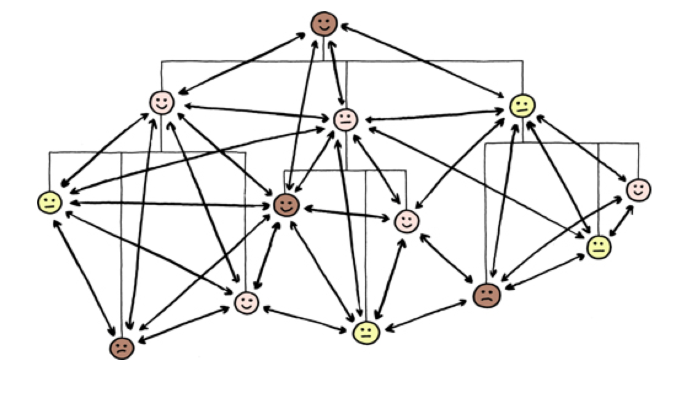
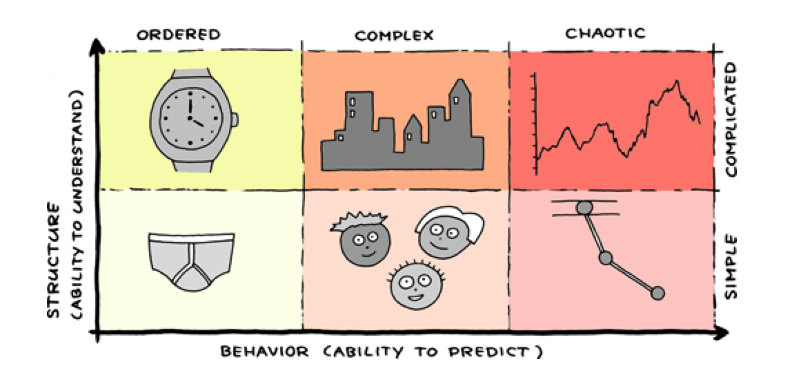
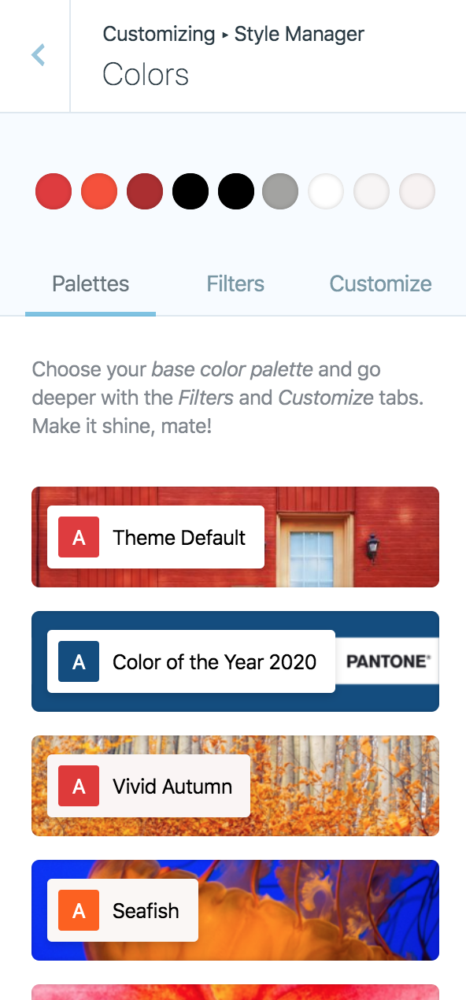
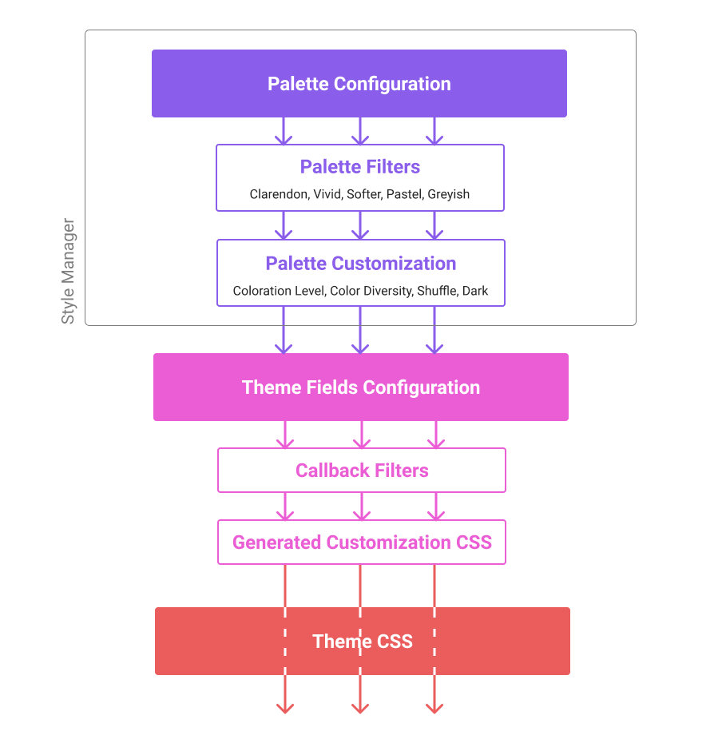
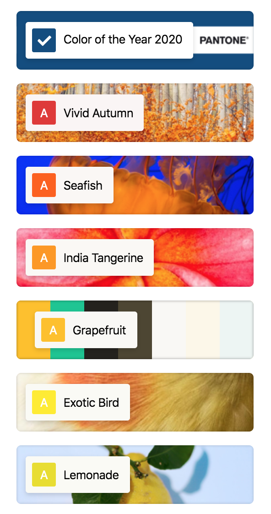
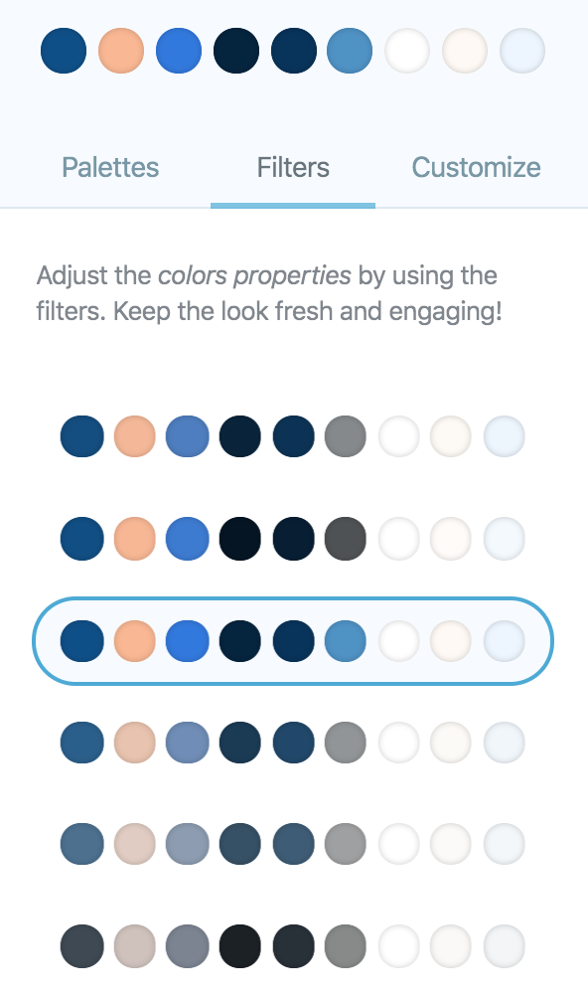
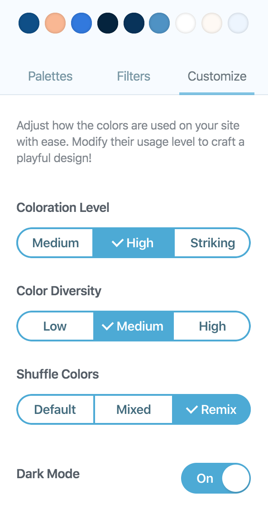

What follows is an essay (i.e., an attempt) about my dives into creating systems that help build and control sites from a global vantage point. My team at [Pixelgrade](https://pixelgrade.com) and I haven't explored and implemented such solutions simply for the fun of it, but as a consequence of our constant, almost pathological, drive to _own design choices and decisions,_ so our end-users don't have to. 

When it comes to **smart, site-building systems,** my aim is _not to empower users with freedom and choice,_ but to _liberate them from such false freedom and choices,_ to provide them with tools and options that are _safe_ to use inside _the agreed-upon design solution._ I've previously tried to explain much of this ethos in the context of [what is a good WordPress theme](/the-good-wordpress-theme/).

## Expectations
Upon embarking on this journey of exposing [my thoughts](/musings-about-building-websites-out-of-wordpress-blocks/) on the ups and downs of transitioning to a block-based WordPress ecosystem (still ongoing for the foreseeable future), through the feedback that I generously received from you, my readers, I realized **there is a very wide range of expectations.** Some of you want just the technicalities; some can stomach a more philosophical approach; some love while others hate reading long articles; some want just the gist of it. I respect each of your needs, but I put my own first. I've explained [here](/why-i-write/) why I write, in general, but I find it useful to set some specific expectations right from the get-go.

Sorry to disappoint but **there will be no TL;DR.** What follows _is_ the TL;Dr of my years of experience and learning. All this is about _complex_ systems — it's right there in the name. It's about abstractions, representations, linguistics, cognition, color theory, spatial theory, psychology, philosophy, computation, logic, languages, and on and on. Just about any manner of interpreting reality could be thrown in here, and it would find its place as a useful way to look at this problem.

**There is no final solution.** There is only _a sufficiently satisfactory one._ There is only good enough in light of the knowledge and understanding we are capable of today. _We can't tackle complex systems with absolute certainty._ We can only tread carefully, as much aware as possible of all that we don't know and understand.

I don't want to waste your time with lengthy writings, but **I will favor clarity and context over brevity.** My aim is not to clock up words, but to pursue understanding, to answer my own questions — hopefully yours too. Currently, I find it easier to do so with more words rather than less. Maybe someday, with more understanding and writing experience, I will be able to express more with fewer words, while maintaining _the same level of clarity_ (this is paramount to me). I welcome that day, but in the meantime, I will do my best today.

## Limits and limitations
For the sake of the above-mentioned clarity and context, let me portray what are the use-cases of the system I have in mind.

I am not after _the one system_ to solve everything there is to solve for website building — far from it. For bespoke sites, like those you would expect to get by working with an agency, such a system might well be overkill. The "dumb" system of page builders will suffice in most instances, coupled with some custom coding when needed. In such circumstances, the final solution is "set in stone" once deployed in the hands of the end-user, and any alterations are closely vetted and controlled by the agency's designers and developers.

I am after a system that can _encapsulate a certain design,_ as envisioned by a designer, provide a healthy degree of flexibility of styling, layout, and content types, and be resilient enough to _maintain_ that design consistency and intent across the entire website, given the almost infinite amount of possible final states (adding up to roughly the number of style options _times_ the number of layout options _times_ the number of content blocks).

So, this is a system that needs to be able to fend for itself in the hands of users, without constant input from its creators. The *decentralized, decoupled nature* of this scenario is the main reason for tackling such a problem. Software doesn't necessarily have to exchange hands like in the case of self-hosted WordPress themes; the same applies to platforms like WordPress.com, Wix, Squarespace, or Shopify. What matters is that we aim for a _scalable, self-service interaction_ between (mainly) content creators and the site system.

I purposely will not touch on ideas such as adding machine-learning capabilities, not for lack of appeal, but in an effort to keep things focused on the fundamentals. Once a working system is in place, much can be easily added to the newborn organism. But first, we need to find a solution for the basic "building blocks of life."

## Semantics
Complex systems theory is.. well.. _complex._ There is no shortage of sub-domains, cross-pollination from related fields (e.g., cybernetics, biology, economics), and even challenges and influences from ones farther away (anthropology, sociology, linguistics). One can easily expand complex systems to include just about everything, but that is hardly helpful, except to acknowledge the similarities and overlaps between various fields. 

Due to this very fluent definition of where complex systems start and end, the popular language around them is also quite hectic. As such, for a better understanding of my thinking, I should explain a few key terms that will pop-up quite often throughout this essay — bear in mind that I do not claim academic rigor.

**Behavior:** In the context of blocks forming a complex site system, behavior is not about user interactions like hover or scroll; it's about each block's ability to respond to certain content types, to the presence of other blocks, to its inclusion in a different site area or as a child of a certain parent. Block behavior is about adaptability to specific contexts, thus making a certain block more widely reusable.

**Relation:** A relation is established between two blocks whenever information gets passed between them, either directly (e.g., a value on initialization or a callback) or indirectly (e.g., parent-child relation). Relations between blocks can be either one-way as in the case of passing information from the global to the local, but never the other way around, or two-way when blocks establish feedback-loops between them. 

**Feedback-loop:** This is a way for a block to ascertain a need or desire toward another block, or group of blocks, and have the mechanisms to check the actual reality of that happening. Think of your room thermostat: you set the desired temperature; you get a beep to know the HVAC received the request (a first feedback-loop); you then see the actual air temperature in the room changing until the target one is reached. Relations that require feedback-loops are the ones where change is not immediate, or may not even be possible.

**Filter:** This is the process by which some piece of information (e.g., a color value) gets passed from one block to another, and changed in some pre-determined way (e.g., lightened by 20%). Often, global information trickles down a set of hierarchical relations, but each block needs to have the ability to adapt it to its own needs, and that of its children. A filter might also entirely block the subsequent propagation of information if some conditions call for it.

**Condition:** This is a logical expression that will be evaluated against the current context a block is aware of, and it will either pass or fail (true or false). Conditions can be attached to any type of entity (a relation, a filter, a block's existence, a group of blocks, etc.). This simple mechanism of switches allows for a great deal of complex, adaptive behavior. Conditions can be grouped, nested, linked; you name it. 

**Context:** This is all the information that is available to a block at a certain moment. It is the sum of external and internal details a block "knows" to interpret and, possibly, convey to other blocks. The external context is the information the block receives about its environment, while the internal context is the information a block can deduce or receive from its siblings.

**Responsibility:** In the context of blocks, responsibility means the ability to act on a piece of information, to behave in a certain way. The question of where to attribute responsibility is fundamental in building a system. Most often than not, there are no easy answers as there is always the choice between delegating it higher in the system (and increase cohesion) or leave it at the lowest possible level (and increase resilience).

**Intent:** This is not about blocks, but about design, as in "design intent." In my book, one of the fundamental benchmarks of a site system is its capability to encompass and ensure the designer's intent is fulfilled, once in the hands of users. A system that allows for nuanced, expressive intent is a system much more likely to succeed with helping both the development process and day to day use.

**Option/control/field:** I will use these interchangeably because I am not after the implementation details (an option is about the database, a control is about the interface). Any one of these represents *a user controllable value* — or set of values as in the case of fonts, that feeds into the site system.

## The need for complexity
> If individual blocks are to thrive and sustain dynamic sites, they need to get swinging, for a living. Blocks need to be smart enough to establish relationships, to adapt to changing environments. Otherwise, they are not much better than bricks in a wall — useful, but dumb.
>
><span class="small">\- From my "[Musings About Building Websites out of (WordPress) Blocks](/musings-about-building-websites-out-of-wordpress-blocks/)"</span>

I am well aware that this whole game of complex systems might come down as a goal in and of itself — me trying to apply my interest in complex systems on every problem I come across. I understand the bias of "hammers and nails," but I can assure you this is not the case.

*Why would you want all this complexity? Why not just design a system that is predictable, with clear boundaries, and sufficient capabilities to satisfy the community?*

Exactly! That is the kind of system I am after! The trouble is you can't have it without it being complex. For our goals, **complexity is a feature, not a bug.** It is something we need, in just the right amount. Without it, *we might as well call it a day and build yet another page builder.*

For me, there isn't anything complex about a page builder; it is a very *complicated* piece of software, with more options than any one person might need, but it is *not complex* by the yardsticks of _understanding and prediction._ A proper example would be comparing the English dictionary and the English language. You can learn about all the words in English from the dictionary. You can even memorize them all or account for all their various endings. Complicated, but doable. Now consider the English language with all its grammar rules and exceptions, its ways to build simple and complex sentences, ways to express infinite nuances. Complex, with no end in sight.

In a real-life, design-driven scenario, while site blocks establish a hierarchical set of relations (very much in line with the DOM), they also engage in _ad-hoc relations across branches_ (behavior). Just consider a header logo that is center-aligned when there are two menus, and left-aligned with just one. This reminds of the way Jurgen Appelo viewed organizational structure in his book [Management 3.0](https://management30.com/books/management30/). Quite a faraway place from site blocks, but it remains wonderfully true, nonetheless. A further testament that, fundamentally, complex systems from various fields have much in common.

<span class="image-caption">The two crucial organizational layers: the network for communication and the hierarchy for authorization - [Management 3.0](https://management30.com/books/management30/)</span>

My focus is to identify and head toward a sweet spot that has **the right mix of structure and behavior.** These are two axes that are fairly fundamental for grasping the dynamics of our desired system. **Structure directly influences our ability to understand a system;** the simpler the structure, the more we can understand and feel in control. **Behavior,** on the other hand, is about our **ability to predict future states of the system;** the more ordered the behavior, the easier it is for us to know how the system will behave in certain future situations; the more chaotic behavior gets, the less we can confidently and usefully make predictions.

Since Jurgen Appelo did such a good job at digesting complex systems theory in chapter 3 of his book, I will borrow his illustration of **the structure-behavior model**. Both people organizations and block-based website systems seem to aim for the same balance, with the same goal in mind: **grow healthy, resilient, evolving systems.**

<span class="image-caption">The Structure-Behavior Model - [Management 3.0](https://management30.com/books/management30/)</span>

HTML is a fairly simple and ordered system, making for static, predictable behaviors. The "enhanced" HTML of the Gutenberg blocks is a more complicated system, but still ordered, resulting in some dynamism, but not much. **Not enough to cross into complex territory.** 

---
With the hope that you are somewhat convinced of the promise of complexity, let's dive right in and explore ways in which I believe we can cross that threshold and reap the rewards.

From here on out, I will mainly refer to themes as a substitute for dynamic site-building systems. It is easier for me to do this since WordPress themes are the place where most of our experiments and evolution took place. But, make no mistake about it, **WordPress themes are just a packaging choice for the much general solution.**

## Global style system
I will first tackle the problem of predictably and consistently alter the styling of a site because that is what we've started with at Pixelgrade. Site blocks are not a precondition to solving this problem because HTML and CSS are suitable replacements. They already provide the needed hierarchy (structure) and expressivity (behavior).

### The general status quo
Ever since premium WordPress themes took off, creators wanted to offer a degree of flexibility to users, first and foremost, in terms of styling. It made sense since just about anyone can relate to colors, fonts, spacings, etc.

Unfortunately, the styling options offered are just _a thin layer of abstraction above basic CSS._ They are very granular, allowing you to change things like headings colors and fonts, body text and background color, buttons background, text and border colors, header and footer background colors, all sorts of margins and paddings. Such controls are very much coupled to individual CSS properties and basic HTML elements.

The "mighty" multipurpose theme and their page builder companion plugins (often bundled with such themes) take things to the extreme, offering nothing less than _a visual programming environment for HTML and CSS._ With each entity you use, you get control over much of its CSS properties. I find that _disingenuous_ with regards to non-technical users — they get dragged into a sort of "programming without consent." I don't think capable, technical users are better off either since they could probably do things easier by just writing that damn CSS.

> I don't like this status quo because it is based on false premises and promises. You, the end-user, are the designer! You, the content creator, have the experience and expertise to make design decisions! Nonsense!

Whenever I see a padding or margin control (with media queries to boot), a button background color control (with gradients just for kicks), I feel some angel has fallen from heaven. Sadly, the Gutenberg editor is happily advancing down this path, too.

### Our status quo
We, at Pixelgrade, went to great efforts to push against the general consensus of "more options are always better." Since the early beginnings, we strived to offer only those styling controls that made sense in the context of a certain design. Where we felt our solution couldn't handle a certain degree of flexibility, we defaulted to refraining from exposing yet another option just for the sake of false "perceived value". Even with this mindset, lots of options would accompany our themes. Too many for safe, predictable styling with _guaranteed_ good end results.

About 4 or 5 years back, we started introducing Style Presets that would simply bundle up a set of colors and font options. While a step in the right direction, it felt rough, too brutal of an approach.

We pushed further and introduced a new system of separate **Color Palettes and Fonts Palettes** that would amount to **our Style Manager system.** Basically, we would leave individual, granular controls available, but would do our best to *help the user stay clear of them* — if he or she felt the need to reach lower in the stack, we've failed in some way and needed to do better.

<span class="align-center half-width"></span>

Let me walk you through some of the technicalities of our current setup.

### Up, up the abstraction ladder


Considering the stack above, I am going to go from the bottom to the top since that is also the direction complexity increases.

**The first step** in departing from the granularity of HTML+CSS is to have individual color or font options control *multiple* HTML elements and various CSS properties. By grouping styling behavior in this way, we can reduce the number of available options, while creating a flow of information (color or font values) more aligned with each design intent.

All of our (Customizer) fields are generated dynamically by the Style Manager system via a configuration. I will try to better explain this with some actual pieces of configuration from our [Gema WordPress theme](https://pixelgrade.com/themes/blogging/gema/). So, rest assured, all of this is battle-tested, production-ready stuff.

```php
'main_content_body_text_color' => [
	'type'    => 'color',
	'label'   => esc_html__( 'Body Text Color', 'gema' ),
	'live'    => true,
	'default' => SM_DARK_SECONDARY,
	'css'     => [
		[
			'property' => 'color',
			'selector' => 'body',
		],
		[
			'property' => 'background-color',
			'selector' => 'input[type="submit"], .btn, .search-submit, div#infinite-handle span button, div#infinite-handle span button:hover, .more-link,
				.sticky.card--text .card__wrap:after,
				.sticky.card--text .card__meta,
				body div.sharedaddy div.sd-social-icon div.sd-content ul li[class*="share-"] a.sd-button:hover',
		],
		[
			'property' => 'border-color',
			'selector' => 'input[type="text"], 
				input[type="password"], 
				input[type="datetime"], 
				input[type="datetime-local"], 
				input[type="date"], 
				input[type="month"], 
				input[type="time"], 
				input[type="week"], 
				input[type="number"], 
				input[type="email"], 
				input[type="url"], 
				input[type="search"], 
				input[type="tel"], 
				input[type="color"], 
				select, 
				textarea',
			'callback_filter' => 'gema_color_opacity_adjust_cb'
		],
		[
			'property' => 'border-color',
			'selector' => 'body div.sharedaddy div.sd-social-icon div.sd-content ul li[class*="share-"] a.sd-button:hover',
		],
		[
			'property' => 'border-bottom-color',
			'selector' => '.singular .site-header, .attachment .site-header',
			'callback_filter' => 'gema_color_opacity_adjust_cb'
		],
	],
],
```

Above is the configuration for the main content body text color field. Focus on the `css` entry that contains a list of CSS "targets" for this field. What this means is that, in the frontend of a site, this field will produce a set of CSS rules using its current value. Quite naturally, the list starts by targeting the general `<body>` color, but it soon follows with more specific `background-color` for buttons, cards, etc., `border-color` for buttons, input fields, etc. 

The last item on the list targets the border of the site header. What is different about his target is that it also has a `callback_filter` entry, thus allowing the **contextual alteration** of the final color value (in this case, its opacity). This is very useful for maintaining strict visual relations like a certain color contrast between a button label and its background. One could take things much further and use callbacks to enforce certain global goals (e.g., automatic accessibility checking and adjustment). 

While it may seem unwieldy to define and maintain such lists, we've learned from experience that this is **the right balance of abstraction and flexibility** that allows us to closely express our intent. It is a chore to create, but you only have to do it once (if you don't change the design).

Like any configuration, this is also passed through several WordPress filters (hooks) to allow other pieces of software (theme modules or plugins) to change this styling behavior or simply add their specific targets to the list. **The system can expand and adapt with ease.** At one point, we've even considered the idea of _creating a sort of scanner_ that would take in the output HTML and CSS of any given theme and determine the first draft of this configuration. This way, we could "bolt-in" our Style Manager to any WordPress theme, with less work on our part. It remains at the drafting stage for lack of priority.

**The second step** we took up the abstraction ladder is aimed at establishing relations between the previously configured options/fields. This is needed because, sometimes, certain options need to either be kept in sync or one needs to control others. For Style Manager, it is the latter case: having options of a higher authority that would pass down information to their "slave" fields. **We called these "connected fields."**

```php
'sm_font_primary' => [
	'connected_fields' => [
		'header_site_title_font',
		'blog_item_title_font',
		'main_content_page_title_font',
		'main_content_heading_1_font',
		'main_content_heading_2_font',
		'main_content_heading_3_font',
		'blog_item_meta_primary_font',
	],
],
```

Connected fields is a very simple and direct way of _creating flows of information,_ mostly in a hierarchical (top-down) manner. Right now, the receiving field doesn't have much of a say, simply accepting the information and making it their own. It will sanitize it to meet its sanity settings (as in the case of font sizes, weights, etc. ranges), but that's about it. You could introduce entry filters and do all kinds of processing, but, so far, we've managed without.

With intent-aligned individual options and higher-level, connected ones, **we can create intricate scenarios** that manage to *control the style of a whole site* in the safe, consistent manner we are after. With these fundamental systems in place, we can move up "in the clouds."

### Style Palettes
Creating a certain color scheme or font pairing implies a series of design decisions that are quite detached from the underlying system of a site. What matters more are higher-level concerns like mood, character, brand, readability, strength, courage, etc. Thus, a style palette should be as independent as possible from any one theme, trusting the underlying system to know what to do with the provided information.

This sudden shift from an inward-looking to an outward-looking perspective has allowed us to imagine workflows much more in line with the "philosophical" mindset of style palettes. A separate sub-system of Style Manager that could do its own thing, with the promise of delivering its output to the rest of the system in a certain, agreed-upon way — **a contract,** or API if you will.

We've resisted for quite some time to introduce such a contract for fear of lock-in, of losing adaptability. Despite our efforts, there was no getting around it: we had to decide on a **static API between palettes and the base fields,** one for each type of palette. In hindsight, it was a non-problem since design always thrives with the right amount of constraints.

### Color Palettes
<span class="align-center half-width"></span>

Each of our Color Palettes is just **nine color values** assigned to the nine entries we've identified as being very much sufficient for all of the use-cases we've encountered in our themes. The fact that, throughout the years, we've consistently experimented with each new theme came in quite handy. So, despite a limited portfolio of themes (20+), we covered a lot of ground. If the API we've settled on would withstand this amount of variation, there is a high likelihood of being just right.

The **nine, semantical color entries** we've come up with are as follows:

```
- primary
- secondary
- tertiary
- dark primary
- dark secondary
- dark tertiary
- light primary
- light secondary
- light tertiary
```

As you can see, we have **three categories** (primary, secondary, tertiary), each with a main color and two dark and light complements. We've thought about a more nuanced naming (like foreground, background), but we've quickly settled on this more abstract naming since the way each theme uses these values varies quite a bit.

Now, even though a Color Palette provides the nine pieces of information, **a theme is allowed to decide which of them to use** depending on its design needs. Rarely a theme makes use of all nine, at least not without some help from the Style Manager system.

<span class="align-center half-width"></span>

As you've already seen in the graphic depicting the styling stack we have set up, choosing one of the 20 or so available Color Palettes is just the start. If a user wants to push the overall feeling in a certain direction, he or she can move on to **Palette Filters.** These are a selection of color filters that each play with the lightness and/or saturation of the color values; some are gentle, others are more dramatic.

<span class="align-center half-width"></span>

If a user is still up for exploration, there are always the **Palette Customization** controls that allow you to interfere with the way color information from Color Palettes gets passed to the theme defined controls (through connected fields). The four controls (Coloration Level, Color Diversity, Shuffle Colors, and Dark Mode) all alter (one after another) the connected fields of the primary Color Palette controls, thus changing the destination of say the `light_primary` color to be like the `dark_primary`, resulting in a reverted color scheme. 

Think of each of these four controls as _a series of prisms_ that each diverge, split, or converge the "beams" of color information onto their targets. With just these four "layers," lots and lots of variations and combinations can occur. Considering you can always go back and put on a different Palette Filter, or even a totally different Color Palette, the fun is guaranteed, and safe.

<span class="image-caption">Just some of the color differences achievable with the four Customization controls, applied on our [Vasco theme](https://pixelgrade.com/themes/blogging/vasco/)</span>

This is the point where we are today with the Color Palettes system part of Style Manager. General, hand-crafted individual Color Palettes, Palette Filters for whole-palette color alterations, and Palette Customization for novel explorations. We are pretty much satisfied with them, so let's move on to a more complex problem.

### Font Palettes
While Color Palettes play with simple color values, Font Palettes are orders of magnitude more challenging. This is because _a font definition involves multiple values;_ eight to be more precise:
```
- font-family
- font-weight
- font-size
- line-height
- letter-spacing
- text-align
- text-transform
- text-decoration
```

The logic of individual, base controls, and connected fields is the same as for colors. Each font control can handle all the different values, although a theme may choose to be a bit more restrictive with some of them, in line with the design intent. Some base controls may only support `font-family`, `font-weight`, and `font-size`, for example. This is not an issue since everything is set up in such a way that anything not supported is simply ignored. The higher levels offer all that they can, while the lower ones use just what they need.

The big difference for Font Palettes comes in the way you express the typographical design considerations behind a certain palette. We all know how much of an art form font pairings are. Well, take those simple two font-family pairs and *couple them* with the rest of the seven values. **Things get overwhelming, pretty fast.** A better, smarter way would be needed to control all these possibilities.

First of all, we don't have two, but **four font(-families).** That is what our diverse portfolio of themes revealed it would take to make our designs happen, typography wise. So, in the order of importance:
```
- primary
- secondary
- body
- accent
```

These are the four font definitions each Font Palette offers. The main workhorses are the primary and secondary ones, but more playful designs also need a body font, and, quite rarely, an accent font (think of drop caps, site title, some large background letters, etc.).

Constraining the number of font families to four is hardly a constraint at all since most people use only two fonts. The complexity is still not reigned in.

When it comes to typography, not all of the eight font sub-values have the same muscle — quite the contrary. **Font-family reigns supreme. Font-size comes in a close second.** The rest can be thought of as _embelishments_ on the structure provided by these two. Thankfully, the font family poses a binary choice: you either use one or you don't. That led us to **make the font size the cornerstone of our Font Palettes system.**

We've ended up **expressing the other font sub-values in relation to the font size.** To properly convey intent, we've come up with **two sub-systems: a curve** for attaching font-size and line-height; **a set of intervals** for connecting font-size and font-weight, letter-spacing, text-align, text-transform, and text-decoration. The need for two systems instead of just one is the result of the fundamentally different behavior of line-height when compared with the rest. *Line-height is much more structural* in nature than the rest, and as such, it needs to be _more aligned with the font-size._

```php
// Primary is used for main headings [Display, H1, H2, H3]
'sm_font_primary' => [
    // Font family loaded when the palette is selected
    'font_family'      => 'Montserrat',
    // Load all these fonts weights.
    'font_weights'     => [ 100, 300, 700, ],
    // "Generate" the graph to be used for determinig line-height.
    'font_size_to_line_height_points' => [
        [ 17, 1.7 ],
        [ 48, 1.2 ],
    ],

    // Define applicable styles based on the font size.
    'font_styles_intervals'      => [
        [
            'start'          => 10,
            'font_weight'    => 300,
            'letter_spacing' => '0.03em',
            'text_transform' => 'uppercase',
        ],
        [
            'start'          => 12,
						'end'            => 18,
            'font_weight'    => 700,
            'letter_spacing' => '0em',
            'text_transform' => 'uppercase',
        ],
        [
            'start'          => 18,
            'font_weight'    => 100,
            'letter_spacing' => '0.03em',
            'text_transform' => 'uppercase',
        ],
    ],
],
```

Above, you have the configuration for the primary font in a certain Font Palette. All the interesting stuff happens through the `font_size_to_line_height_points` and `font_styles_intervals` entries.

The `font_size_to_line_height_points` entry is *a list of points* on the plane defined by the font-size and line-height axes. One can define as many points as it needs to precisely describe the desired curve. The system will _interpolate_ between these points to determine the function that will produce a line-height value for any given font-size.

The `font_styles_intervals` entry is *an ordered list* of interval definitions on the font-size axis (the `start` and optionally, `end` sub-entries), each segment carrying a set of font style values. The system "flattens" all these intervals (latter entries have a higher priority) and ends up with non-overlapping intervals to use in determining a set of font style values for any given font-size value.

Through the mechanisms of these two sub-systems, we've managed to **make Font Palettes theme agnostic,** and also allow for the possibility to introduce a similar kind of filters and alterations as seen on the Color Palettes. This part is still *work-in-progress* since acting upon the complexity of Font Palettes requires new controls like interactive curves or interval shifters. We don't have all the solutions yet, so I will not go into that right now.

The important thing for me is that we've managed to have **a Font Palettes system that can express the vast amounts of design decisions** that are made by designers when they put their typographer hats on.

---

Circling back to the talk about complexity, relations, behavior from the first half of this essay, I am well aware that you could be somewhat disappointed by the Global Style System I've just described. I agree. While quite complicated, when it comes to the complexity I've cheered for, the system is kind of an infant. The relations are mostly hierarchical, with mostly top-down information flows.

I am *glad* we could get away with so little complexity in creating such a system. It is also further proof that global styling is a much more manageable problem than global site layout (with blocks). There is *a nuance* here, and I don't want to shy away from it: if we would look to *couple* the complex behavior of blocks in terms of layout with a *dynamically-defined* global styling system, then I am confident the solutions I've just described would be insufficient. There would be *a surge of bottom-up information* that the current system simply couldn't handle. Yet.

It is best to choose our battles, if we can.

Your mind must be pretty tired by now. I wholeheartedly appreciate all the effort you've put in to stay this long. Take a break, have one more cup of coffee or tea, and let all my meandering ideas sink in (or drift away). When you are ready, it would mean the world to me if you could *share back some of your thoughts and experiences.*

Oh, and *subscribe below* so I can "ping" you when **the second part of this essay** is available. I will write about my ideas and experiences around Site Blocks Systems.
