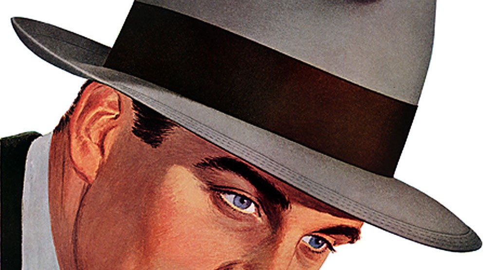
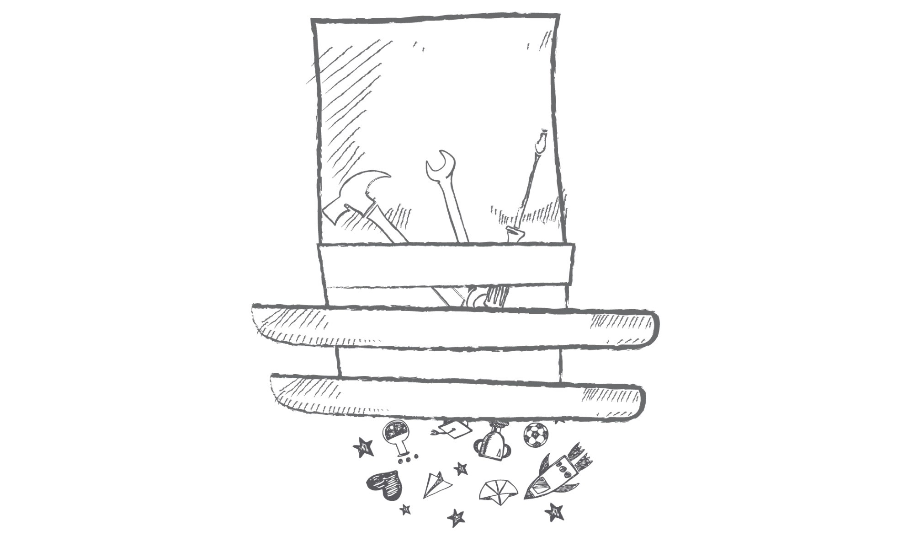
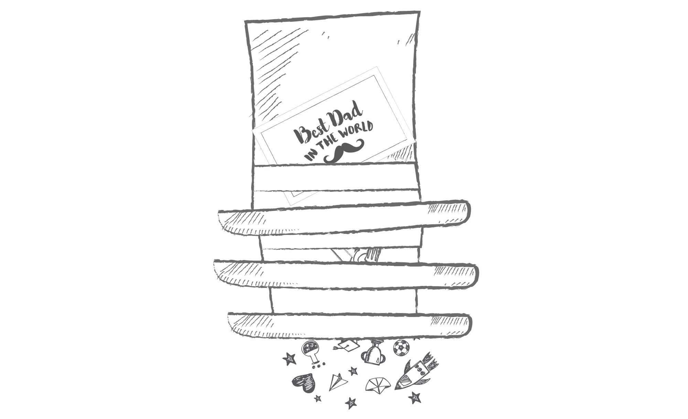
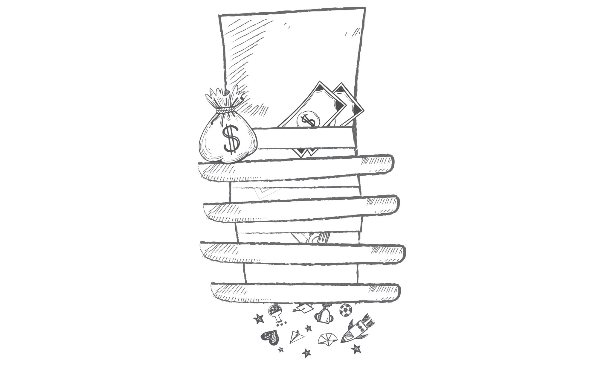
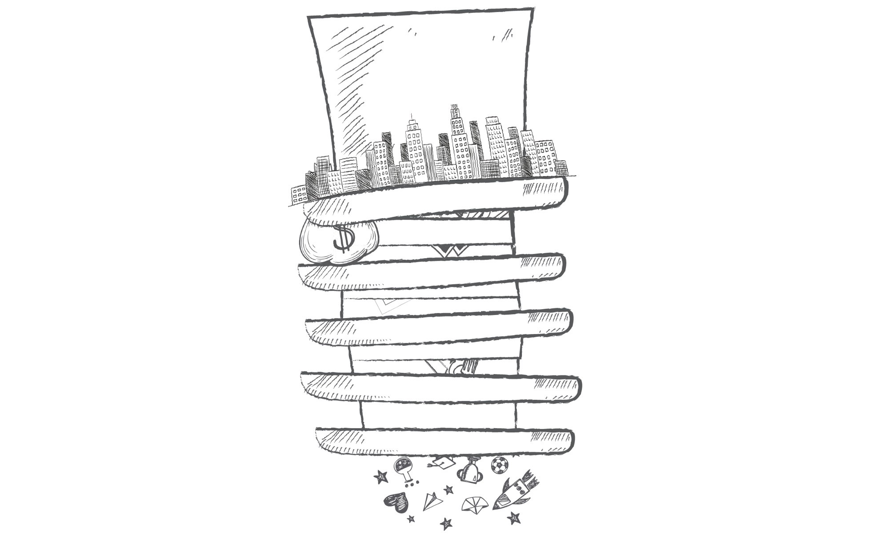
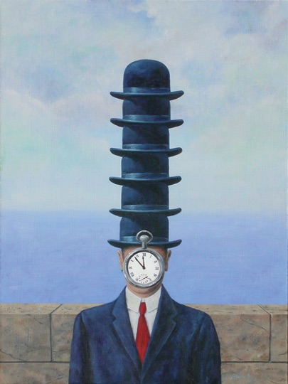

Ever since I've deep-dived head-first no-safety-line into this adventure of co-founding Pixelgrade my life has changed, in unexpected ways. Little did I know at the time I would be taking *the ride of my life*, that I will be fulfilled and energized beyond my wildest dreams while being stretched and challenged to breaking point and beyond. It's probably for the best as some things should not be known from the start.

Some would think a founder brings its experience and knowledge and sets to purposely give shape to this thing we call a business. It hasn't worked like that for me as I had no prior experience and little knowledge of what a team, let alone a business, needed to look like. Frankly, I still don't have a turn-key solution to this day — maybe when I'm gray and old.

What me and my brother George brought at the drawing table was just ourselves, two twenty so years techy guys with grit, open hearts, and clear sights. We've drafted this whole thing to our image. Anything else felt wrong or without meaning (sounds an awful lot like the definition of narcissism, right?). In reality, a devilish thing happened: *Pixelgrade defined me just as I helped define Pixelgrade.*

## The Hatless Head

In the early days, my head was a thing of beauty: perfect proportions, perfect haircut, perfect nose, perfect jaw, perfect in every single way. Then tragedy struck, and it became, almost overnight, the head I have today. Now that's off the table, let's focus on what was inside that (perfect) head of mine.

First and foremost, there was hope and faith that everything will be just fine. It was self-confidence that I would plow through everything that might come my way. It was patience as good things happen to those who wait. There were passion and energy to last you a lifetime. I also had my fair share of foolishness or child-like playfulness to keep me fresh and on the move.

There was one more thing lurking in there, the bedrock if you will: *trust, in people.* If it were a Buddhist monk's head, it would babble all day long: Have faith in people! Trust people! I know it sounds like I'm exaggerating, but the reality of my beliefs was not far off. I genuinely believe in the huge potential that rests in each of us and that if only it would be given the right setting it would blossom into something worthy to behold.

But what is a founder's hatless head? The perfect place to put a hat, of course. Luckily, or unfortunately — I am still not sure, there was no shortage of hats willing to do the job.

## Hat #1: The Dreamer

This hat suited my head just fine like it was made for me. A hopeless optimist with a love for intellectual tug-of-war and the world at large seemed to be just the right person to look ahead and guide the ship.

I wear this hat with pride and joy, but also with a deep sense of responsibility as I am fully aware that everyone else is counting on my ability to spot opportunities and perils ahead. Unfortunately, there is a dark side to this hat: it can be quite lonely up there on the mast. And with loneliness comes detachment from the rest of the crew — a deeply scary thought for me.

## Hat #2: The Craftsman

Yet another hat that my head will gladly wear. This one is extra-special as it was shaped throughout my whole life — *it's what makes me a doer.* I owe this hat to my family and to my teachers, to everyone that taught me the value of doing something from nothing, of using my creativity and perseverance to achieve meaningful results, the value of overcoming highs and lows just to see something done, properly.

Understandably, it is easy and fulfilling to wear this hat. It allows me to dive deep into technical issues and pound them into submission, to explore novel, more elegant ways of solving old problems. It's my comfort zone, where I am able to feel in control.

This spell-like nature makes it dangerous if worn too often for too long. It's too easy for me to lose myself in the doer mode while ignoring my other responsibilities towards the ones around me and the organization as a whole.

## Hat #3: The Father

This is a hat I haven't wished for, but somehow grew on my head. I was always under the impression that I had a flower-power-friend hat, or at least a teammate hat. But no, I actually had this paternal hat and its weight started to take its toll on me. It's not the sexiest hat on the catwalk, it's infused with all the wrong perfumes, it's old-school, commands respect and authority, but of the *wrong* kind.

I look to be respected for my merits, for the skills and insights I bring to the table, not because I take care of everyone and make sure that I keep things as easy as possible. And what authority I can muster I wish to ground it in mutual understanding that it's for the better of all, not as a direct result of me “giving birth” to Pixelgrade.

## Hat #4: The Banker

I am not the son of a financier nor did I inherited an insane amount of wealth, but nonetheless I have this weird pointy hat in my closet. I am generally OK with money: I understand them, I know their proper value, I can handle them by the truckload or in bite-sized chunks. I'm not overly impressed by them, nor do I disregard their power and meaning.

*So what's the problem? Stop bitching and enjoy your pointy hat, you lucky bastard!*

I wish it were that simple. In reality, this hat is stuffed with unseen late-night worries, constant struggles to prioritize spending and find new ways to keep the flow going, hopefully with an upward trend. Over time I've learned to cope with these, to some extent.

As you would expect, something else was going on under there, and it wasn't what I wished for, again: it makes it too easy for others to stamp me with the “boss” tag. I am asked to put a *price* on my teammates' work and convey my reasoning behind that. Easier said than done especially when people have such varied relationships towards money and what they stand for. The fact that, statistically, most of us believe we are above the average performance of those around us doesn't help me either.

## Hat #5: The Architect

This is a cool hat, right? It has such a nice ring to it. I guess this is part of the reason I graduated Architecture School. All fallacies aside, I am a systems kinda guy — I enjoy discovering the inner workings of things, their true logic and meaning. I generally try to avoid shallow observations and go beyond the first impression as I believe we live in a complex world where everything and everyone are connected. This sense of endless possibilities fuels my hope for a better future.

For a long time, I've been delusional and foolish as I've underestimated the complexities and hurdles involved in managing people systems — *teams*. I convinced myself that a system is a system is a system. What is so different from designing the place a family lives or the way part of the city should function, and designing the way a small group of people should work wonderfully together? As it turns out, an awful lot.

My first mistake was to think one can design the way a team works. Sure, you can do it in an academic setting and imagine things. But the reality is that a team just is, from the moment at least two people decide to work together towards a common goal. There is no undo button, no rewinding of time. You got to live with the consequences of all of your decisions and do the best you can today as tomorrow's team will be different.

My second mistake was to overshoot my trust in the power of good intentions: as long as each team member's heart is in the right place all will play out just fine. So I wore this hat every so often without really owning it, with a sense of fear and shame actually as I didn't want people to see me as a God-like creature that's playing Sims — Business Edition. I struggle with this to this day.

## The Hatfull Head

Illustration by: [J.Scott Collard](https://jscdesign.wordpress.com/2010/02/22/too-many-hats-not-enough-time/)

The count doesn't stop with these five hats. There are other smaller, less visible hats in my closet, some that I am not even aware of. Not to mention the hats I need to wear in my personal life: husband, father, son, brother and the list could go on. Someone is playing tricks on me.

Sticking to these five hats, the reality is I can't pick and choose when to wear them. There is always someone around that expects me to be wearing one of those hats — so I end up wearing them all, all the time, whether I like it or not. I am built to cope with many things on my plate so I should be fine, at least to some degree.

The trouble is these hats demand quite *different mindsets* to function well. Shifting mindsets all the time is not sexy, nor is it efficient for the end result. It is also a sure way to disappoint and piss people off either because they've caught you with the wrong hat, you haven't really worn that hat for a while, or you are having trouble shifting mindsets. It's a game I for one feel that it can't be won — and I hate losing, much less playing when I know I can't win.

## The Sane Head

Ideally, there would be a single hat for every head, but that is just not feasible and possible in real life situations. So there is no point in wishful thinking.

What one can do is first become fully aware of its hats, their implications, their requirements and see how can they be grouped together in compatible, meaningful, fulfilling ways. Those are the hats that should be kept and cherished.

Secondly, we should try and surround ourselves with people willing to wear more than one hat so we can share a closet or give away hats to them — they may very well be more capable and happier to wear them. It's a win-win situation.

Thirdly, everyone should be empowered and helped to *lead from where they stand.* You don't need a special hat to make small decisions, to spot things worth improving, or to give someone your feedback. You just need to be willing to lend a helping hand and work towards the greater good — we are all in this together.

_This story was initially published on [Medium.com](https://medium.com/@vladpotter/the-founders-dilemma-many-hats-one-head-7b413812792d), but I prefer it to live here. It think it feels more at home._ 🤗
