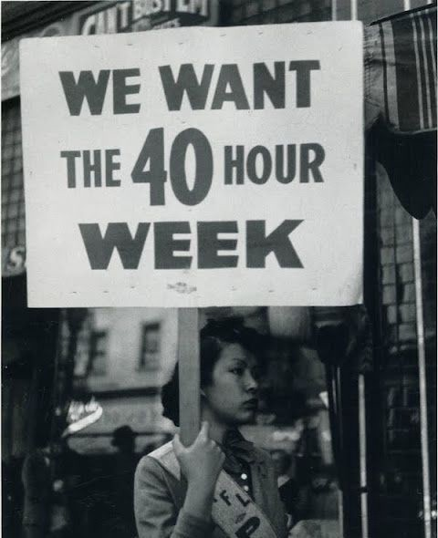
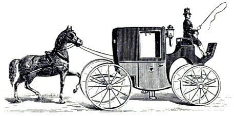

I have a hard time making the 40 hours work week my friend and my ally. It and I seem to be playing a game of chicken: who gives up first. Right now, we are at a stalemate: we agree to disagree.

First of all, I am only considering this in the context of “creative industries” where people are expected to dream up new things, to come up with elegant solutions to problems, to go the extra mile and deliver superior, innovative results, constantly— the exact opposite of the context where it first appeared, in the Industrial Revolution.

Secondly, let me get some things off the table, right from the start. An 80 hours work week is insane, bordering on cruelty; it should only be an unfortunate exception commanded by the mother of all emergencies. 70, 60 hours per week are not very far away either — it's 10–12 hours a day, 6 days a week; I find it hard to see how doing this on a regular basis could lead to anything but burnout and poor quality of work. Now back to our 40 hours.

The tagline [“40 hours a week is plenty”](https://m.signalvnoise.com/80-hours-now-40-hours-later-f0b3621816e), so rightfully portrayed by someone who I look up to and admire — Jason Fried from Basecamp, sounds so clear and full of decency: decency for work-life balance, for one's sanity, for one's physical and mental health, for giving time to ideas to breathe and germinate. I can't argue with it. So why am I then at a stalemate with this idea? The real insight lies in this comment from the same Jason Fried:

> Think of 40 as a representation of a “fair's day work” rather than exactly 40 hours. But definitely not much more.

A *fair's day work* is something I can relate with; it is much more personal and adaptable to one's current professional state of affairs; it implies merit and results, dedication and quality, a balance between your personal perception and the one of your peers.

Recently, in a documentary, I've heard something that really reverberated in me as it provided the key to making sense of a lot of conflicting thoughts and ideas: the origin of the word *amateur* as opposed to *professional*. Most of the time, calling another person an amateur is done (or perceived) with ill intent, with condescendence, dismissiveness, malice if you will. It turns out, the term was originally intended to depict someone who does something *just for the pleasure of it*. I like that a lot.

All of us creative “professionals” start out as amateurs, people full of passion and desire to leave our mark on the world, people with wits and grit to tackle things way beyond our reach, people confident that with enough energy, thought and effort any problem can be solved. We are so so lucky to have this leeway. The problem is this initial state of wonderful agitation doesn't last. That flame burns too brightly to be sustainable in the long run.

We need to make small but confident steps towards being a professional, for our own sake and for our team. We need to understand ourselves better, to be more aware of our physical and mental limitations, to know when to pause and when to speed up — it's what people call *experience*. But it doesn't come simply with the passage of time. You can't say I've done this work for 10 years, hence I have experience. If you haven't developed a certain *work wisdom* during those 10 years, I feel sorry for you. You are probably in a worst spot professionally than someone just starting out.

What do amateurs and professionals have to do with the “40 hours work week”? In my mind, a great deal. That “fair's day work” is much closer to fairness when it comes to a true professional than it is when we talk about an amateur. That is why, for me, taking only the number of hours, sticking to them and see what you can cram in there is a fallacy, at best.

A saner, more down-to-Earth approach is to be mindful of yourself, your self-expectations, weigh in the requirements of the team you are part of and find the balance that pushes you forward, today. If that sweet spot is for you 40 hours or less, I salute you — you are luckier than you realize. But if it's 50, 55 hours a week that is ok too. Just remember to constantly reassess and don't mistake long hours with steps towards being a professional. In certain stages of your journey, fewer hours is exactly the right thing to do; in others, no hours a.k.a. vacations are absolutely essential.

Just don't put the cart before the horse and “act professionally” *timewise* without being there *in wisdom* also. You will only stall your own progress and disappoint the ones looking to work with you. Stay *mindful* of yourself and where you are *heading*, forget arbitrary numbers.

_This article was first published on [Medium.com](https://medium.com/@vladpotter/in-all-fairness-the-40-hours-work-week-6004548d5154). I guess I also put the cart before the horse. Time to put things in order._
