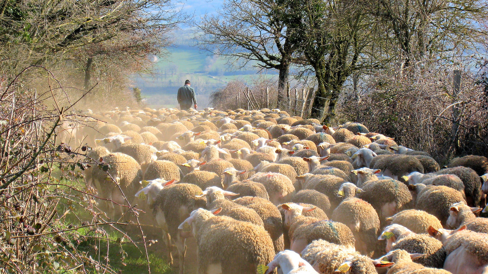

_Building stuff is hard._ Just try and make two stones stay on top of each other.. with kids playing around.\
_Building digital stuff is even harder._ Just try and make two images sit nicely beside each other.. while resizing the browser window.\
_Building digital stuff that builds digital stuff is downright risky._ Just try and make the system that generates the webpage that keeps any two images sit nicely side by side.. while using a smartphone.

**TL;DR: The higher we climb up the abstraction ladder, the harder and riskier things get.**

Self-evident, common-sense stuff, right? It's almost instinctual to consider juggling three balls in the air harder than just one or two. But what does your intuition tells you about _how much_ harder is it, actually? If you've tried juggling, you already know the answer, but if you didn't, you're very likely to consider juggling three balls as 50% harder than with two. In fact, if you've been training really hard, for a long time, with just two balls, you will get a boost of self-confidence  — 30, 40% tops. People into cognitive sciences, behavioral economics, or risk management already know where this is going, but please bear with me a little longer.

Reality of life — and science in the last decades, has shown us that we humans are very poorly equipped to deal with anything exhibiting a non-linear progression. We assume the world is behaving linearly just as night follows day, yearly seasons, weight or speed of stuff. We are deeply accustomed to the linearity of our own life's time, with how heavy two gallons of soda are compared two one, with the speed a rock reaches when dropped, with how difficult a two-mile run is compared to just one. We have a well-honed sense for the physical world since it has been _the only one_ we've known for the most part of our journey as a species. And the physical world, at least at the pre-industrial human scale, is a very linear world; in some aspects actually static, in others with linear growth or decay.

When we focus our attention and aspirations beyond the physical, we start to work at _the fringes of our natural capabilities._ We have trouble, even today, getting to grips with "simple" things like gravitational acceleration, compound interest, or Ponzi schemes. We need to work hard to understand even the most basic of non-linear behaviors. Sure, one can get better with time, but it's a constant struggle.

In pre-computer times, our _hunter-gatherer brains_ had to juggle with two large conceptual realms: our perception/interpretation of the physical environment and our ideas and thoughts of the metaphysical. One was either trying to get to grips with a "real" problem (build a car, a rocket, or a bigger bomb), or one was "just" thinking about pure ideas (the meaning of life, a better way to organize people and societies, parallel universes). **You think to do stuff or you think to think stuff.**

The computer revolution gave birth to a third world: **the digital realm.** A quirky one to boot. This world is neither just an abstraction of the physical, neither a completely separate conceptual field. 

A large section of society is naturally equipped to link it, tightly, to everyday reality. We identify patterns, instinctively put a layer of metaphors, and apply them to this medium poised on receiving anything with open arms. Since it doesn't seem to mind or push back, we find great joy and fulfillment seeing our "original" patterns and metaphors take actual shape outside of our minds, able to effortlessly show our creations to our tribe. The end result feels physical in a way. Now that we can touch "things" through a screen-glass, even more so. Our hunter-gatherer brain is contempt. It would prefer something more down-to-earth, but this will do.

There are other _homo sapiens_ that have a knack for taking concepts further, much further. They consider the digital as a whole new way of seeing and thinking. They acknowledge its newborn purity and promise; they appreciate its neutrality with the past. These free-thinkers see this world for what it is: a fresh start bogged down with only the past we force upon it. Actual (creative) freedom is at hand — wonderful. Soon, a much, much sweeter source of dopamine comes into view: _power, unlimited power._ If one detaches their thinking from the mental harnesses of physicality, the digital world is keen to offer power over anything you can think of. You can build a two miles high skyscraper, an actual army of orcs, endless streams of information, or entire societies following your every command. This bottomless well of power is utterly mesmerizing, even for the most brilliant of us. 

The vast majority of people that seek to build something in the digital world are somewhere in between the physical and the digital purity — constantly shuffling deep instincts and rational clarity. Most often, we do this without a shred of self-awareness. This brings me back to our ability to deal with non-linear behavior. More specifically, our capacity to comprehend and control this kind of behavior in the systems that we build.

So, how much harder is it to juggle three balls when compared to just two? It is actually **at least twice as hard.** Adding another ball makes it again twice as hard. In mathematical terms, we call this an exponential progression (like this series: 1,2,4,8,16,32,..) — things get excruciatingly hard, very fast. In real life, this kind of behavior is widespread in nature. So common in fact, you would think we would have evolved with a deep understanding of it. Unfortunately, most such phenomena happen either too fast, too slow, too large, or too small for us to observe it with ease.

E. coli colony growth - [Source](https://en.wikipedia.org/wiki/Exponential_growth)

There is a second layer to our troubles of comprehending complex behavior: _the more familiar we are with one stage, the more likely we are to underestimate the increase in complexity of subsequent stages._ Since juggling seems to be my current theme, imagine you have mastered to perfection juggling with three balls. You could do it with your eyes closed. When presented with the challenge to up your game and try it with four, you are much more likely to consider it easier than it is. In fact, all your hard-won muscle memory and mental timings will make it much harder than usual for you to learn this new skill. _You gained certainty and safety, but lost elasticity._

Deep within our brains, there is a powerful tendency to _default to what we already know_ and infer the needed information from that. It's a mechanism to help us cope with new, mildly unpredictable situations. Frankly, it was meant to keep us alive and sane — I feel grateful for that. But, the type of complex systems we engage with in the digital world have a nasty habit of _throwing a monkey wrench into our predictions._ Right when you are certain that your understanding is enough to make it happen.

---

_Fuck, Vlad! I thought this was about blocks and building websites.. WordPress and the like. Can we get to that? This century!?_

Well.. I did. Deal with it. The end.

---

If you needed to say that, I hope it helped you vent a little bit. Now let me try and put all this philosophizing in the context of building systems to help users build websites. To further bring these ideas home, I will explore the currently ongoing process undertaken by WordPress, namely [project Gutenberg](https://wordpress.org/gutenberg/) aka "everything is a block." Here's [the overall vision](https://ma.tt/2017/08/we-called-it-gutenberg-for-a-reason/) straight from the horse's mouth.

You don't have to be familiar with the project to be able to grasp what follows. It helps, but everything concerning site builders revolves around the concept of blocks. From the Wix or Squarespace site builder to corporate design systems. WordPress hasn't embarked on solving a problem specific to its ecosystem. The implementation does and will have to deal with the unique forces that give WordPress its strengths and weaknesses, but many of the challenges are common throughout the digital world.

## Divide et impera

Any human that tried to solve a somewhat complicated problem has eventually resorted to this algorithm — even if unknowingly. Computer programmers have it tattooed on their hearts. It's simple: take whatever problem you don't have an answer to and divide it into increasingly smaller sub-problems until you feel confident you can fully grasp all the variables and relations of each sub-sub...-sub-problem. Solve each problem on the lowest level, and you should be able to climb up and integrate the related sub-problems to solve the bigger ones. You have conquered _(impera)_ the problem — and learned about recursion in the process.

This algorithm is praised for its universal applicability. From cooking a meal, to manufacturing a toothbrush, solving an algebra equation, writing software to fulfill a requirement, up to societal problems like climate change and inequality. _One hammer to nail anything._

2 stupid dogs - 90' Cartoon Network series

It's cute to have this fancy thing in your toolbelt.. but it's wrong. Divide et impera was only meant to be used in situations where _one is in full control,_ his or hers only problem being comprehension (our inability to hold more than 5 or 6 variables in our heads at the same time). In other words, the processes involved in solving the sub-problems would be the same as solving the bigger problems, only easier. Importantly, integrating the results of sub-problems should not pose any new challenges, hence the necessary full control over the problem domain.

So, is it website building with blocks a problem that we could nail with this hammer? I am confident it is not, not in its entirety. More importantly, not where it counts.

## First there was a block

_..and it was fun. Endless opportunities lay ahead. Actual, palpable progress was being made. All are happily skiing round a snowball._

Solving the _blocks problem_ seems like the obvious first step to take if you are to stand any chance of getting to the _"system that builds.."_ part. And I agree. So did the team behind the WordPress block editor.

The _full-site editing problem_ was narrowed down to just _post content editing,_ as a first phase. In the reduced complexity of the post content, the new block editor could germinate, overcome fundamental challenges, and grow toward a stable solution. Work done here would lay [the foundation](https://developer.wordpress.org/block-editor/principles/key-concepts/) for solving bigger problems.

With surprising speed, for such a large undertaking, within two years of starting work, a stable solution was safe enough to be put in production (WordPress 5.0). Long before that, a working version was available to developers. People got familiar with the concepts and conventions; they appreciated the new set of tools and started building various blocks, with glee. Divide et impera and community effort at their best. Soon, almost a new ecosystem took life within the larger one. One of blocks; beautiful, diverse, clever, powerful blocks. Competition naturally appeared, and for the better. More opportunities for end-users to find the right solution for their particular problem.

On the technical/architectural side, things seem to hold just fine. Sure, one can't foresee everything from the start, and adjustments had to be made. But, for the most part, the system is working, and thriving. I for one would have loved to see a clearer set of guidelines and APIs for handling the editor's user interface, one more in tune with the ethos of WordPress of _extensibility and adaptability._ But that is not a fundamental issue that could not be improved upon down the road, albeit with some legacy concerns. But still, manageable.

## Tunnel vision with glee

All this, understandable, excitement allowed a different kind of dynamic to take root in the system. At both ends of the contributor spectrum. Developers building _with_ the new block editor started adding more and more features to their blocks pushing the editor UI to breaking point. Developers and designers building the editor and its core blocks also jumped on the bandwagon and kept on boasting on each update with ever less important features: a color picker here, a gradient there. At the same time, they had to take notice of the UI challenges encountered by the community and try and come up with solutions.

Lots and lots of energies were and are still being poured into the individual block and the post content editing UI and UX. While this definitely helps end-users, I can't help noticing how the initial mantra of "everything is a block" is shifting toward "everything is _just_ a block." This distinction is subtle, but important in the long term. It paves the way for overconfidence. Just like the person that mastered juggling three balls to perfection.

If the entire point of this journey would be limited to just _the linear world_ of a piece of content, all would be swell. But it wasn't, and it isn't. 

## Mistaking multiplicity for complexity

Our all too human inability to naturally comprehend complex systems and complex behaviors leads to all sorts of fallacies, each coupled with a healthy dose of hubris. 

A common one is our failure to differentiate between groups of the same kind of things, without any structure (homogenous), and structured groups, possibly with multiple kinds of things. A mouthful, I know. An example will help you wash it down, for sure.

Shepherd and sheep doing their thing - [Source](https://www.flickr.com/photos/joanet/5797069081/in/photolist-9Qgw6t-9QguEV-9Qgt2P-8QzaUf)

Meet Johann, a middle-aged, industrious shepherd from an Alpine village. He and his family run a medium-sized farm with about 200 sheep. In his youth, he started with a modest 30 sheep received from this father, as a loan — needless to say it didn't help smooth their already fractured relationship. Armed with the grit commanded by the brutal heights he calls home, he slowly increased his flock to a respectable size, loan returned and all. Johann even added some 20 goats in the mix, just for diversity — he kinda likes their playfulness. He knows all there is to know about sheep (goats are kind of the same, in his book) and is thinking to grow his flock to about 1000. He won't have to work much more — the sheep tend to know how to keep out of trouble and eat that darn grass. OK, maybe a couple more dogs and some extra helping hands come shearing or milking time — raising seven children just might have been worth it. A manageable undertaking, regardless.

Now, meet Joseph, a middle-aged, clear-eyed mayor of a small Belarussian village, just north of Minsk. His village is home to about 900 people. Wonderful, hard-working, diligent people Joseph has come to know and respect. Every Monday morning, he goes on his "troops inspection" as he likes to call it (he comes from a long line of army men). Joseph makes his way down every street, no matter how small, and pays close attention to each household as they go about their life. Each of these Monday walks reassures him that all is well in his little village. Under his 4-terms watch, things have gone from poor to great. The thought fills him with pride and confidence. So much so, that he becomes convinced he is on to something bigger here. His way of managing this community is right. More than right.. perfect! In a foggy September Monday morning, upon finishing his "inspection," he has a stroke of genius: how much better it would be if other, less fortunate people could enjoy this as well?! And with their help, how much better could this village get?! The sparkle in his eyes could pierce through the deepest of fogs. That very day he drafted a plan to start a marketing campaign in neighboring villages with the goal of increasing the village population to 4000, preferably five or even 6000. A couple of years should be enough.

Who would you trust with your life savings? Apart from those of you that dosed off by now, I reckon most would find Johann, the shepherd, as a more reasonable, trustworthy kind of guy. He deals with a homogenous flock, and he knows it. He is well aware of the short-range of behaviors sheep exhibit in a group, and even invites some goat-driven diversity. Joseph, the mayor, on the other hand, ends up thinking about large groups of people in pretty much the same terms as Johann, to everyone's peril. 

"What works for a few will work for many." You and I both know how such a people-management approach can go terribly wrong, fast. We see it in history, we see it in our flat corporations, in our disconnected communities and nations. Groups of people will develop structure whether one likes it or not. And the larger the group, the more complex the structure. All because each sub-group behaves quite differently from the sum of individual behaviors, even if we would consider only sane, well-behaved, law-abiding individuals.

## Making the jump from content to sites

All sheep and villagers aside, I see great peril in tackling complex systems like those involved in building entire, dynamic sites, through the lenses of a build-up of experience anchored in a linear world. Bottom-up will not do for a healthy comprehension. Alas, top-down will not do it either. Only pogo-sticking from top to bottom, and occasionally randomly in between, could allow for proper solutions to surface.

Getting back to WordPress' Project Gutenberg, I can see some early signs of the unaccounted increase in complexity lurking just outside of the post content. The first became apparent in tackling the header and the footer in a blocky way. Even in the relative safety of this narrow problem, what had seemed to work for content appeared to be insufficient. And for good reason: site menus, logos, copyright notices, or announcement bars don't seem to have the same agenda as a paragraph or an image. 

Those simple groups of text, links, icons, and images seem to be from another planet. The reality is that they are, despite some shared similarities with the content "people." My understanding tells me that things are only going to get weirder the more we venture up the abstraction ladder. One should slow down and think more at each small step.

Some Star Trek training may be required - [Source](https://vulhcan.co.vu/post/114700084030)

## Making the jump, but in VR

Keeping up with the bottom-up ethos of the WordPress block editor process, the team decided that the first thing they should tackle, on a global level, should be styling. Thus work on the [Global Style System](https://github.com/WordPress/gutenberg/issues/19611) started. I presume the narrowed scope of this problem seemed a great fit for a testing ground of ideas related to handling block-based websites, globally. "If we could get global styling working, we are much closer to cracking full-site editing."

I am intimately aware of the challenges posed by building up such a system through my work at Pixelgrade (we call it Style Manager). It is hard, but doable, in large part because it relies on a tried-and-tested system that tackled most of the deeper issues: CSS. CSS is _the global styling system_ of the web, and all we need to do is play nice with it. That is pretty much what the Gutenberg team is aiming at.

My point is that the lessons one may learn from building such a system are only marginally applicable to the more abstract scope of handling an ecosystem of blocks. Again, there is vast opportunity for gaining false confidence.

A much more fertile learning scenario would involve aiming to free blocks from "the tyranny of the cascade" (the C in CSS) and allow them to be _styled in relation to neighboring blocks._ The same result we now need to _write_ pure CSS for. 

Tackling **the problem of establishing ad-hoc relations between blocks** is _the real hard nut_ one needs to crack for full-site editing to truly work. And the sooner it does, the faster and nicer things will coalesce into a stable, working system. And the less time will be wasted on reengineering the fundamentals.

## Static versus dynamic

Language is a bitch. The words we use are the words we think with. The more we trust words, the greater the risk of them leading our though processes astray.

WordPress is an ecosystem that eats and breathes dynamism. This is what made it so wildly successful. WordPress sites are dynamic by default. You don't start with a static scenario and start bolting on dynamic bits (like JAM stack solutions). This runs so deep in the ecosystem that we often take it for granted, and completely forget about it.

A piece of content is not dynamic. It's as static as it gets. Sure, you can edit it, intertwine it with dynamic blocks, even aggregate pieces of it into larger structures. But, fundamentally, the actual content is still very much _"set in stone"_ (physicality at work again). No wonder editing content is one of those site permissions we easily give to just about anyone involved in creating and maintaining a site. It is safe because of its static nature, block-based or classic wysiwyg.

We rightly feel shivers down our spines when a non-technical crew member asks us for permissions to play with the overall site structure. We know how connected things are and how fast they get messed up. We want to tread carefully.

Alas, there is no "structure" in "full-site editing." It's just (content) _editing_ on a larger scale. You feel it safe, even welcoming. I am confident this language-induced sense of safety is a false one. Real, but false.

Complex systems (like a website, not individual pages) are not edited or stitched together. Complex systems are built, actually _grown._ How safe does "full-site growing" sound? Far less, if my intuition is any good. How about "full dynamic-site growing"? Not so confident, ha?

## Professional swingers

If individual blocks are to thrive and sustain dynamic sites, they need to get swinging, for a living. **Blocks need to be smart enough to establish relationships, to adapt to changing environments.** Otherwise, they are not much better than bricks in a wall — useful, but dumb.

How could a collection of blocks add up to something coherent and valuable without a way to establish relationships and describe behaviors between individual blocks? Not just visually, but also functionally.

To handle the needed complex behavior that adds up to the benefits of a more complex organism (as opposed to individual, dumb blocks) we need to "enhance" individual blocks (or homogenous groups of them) with the ability to "sense" other blocks and interact with them, while sensing and interacting with the overall organism boundary.

In WordPress' Gutenberg editor, blocks are firmly rooted in the "dumb" HTML world, by design. And this is a problem for "full dynamic-site growing." A minor nuisance for "content editing," but a proverbial "spanner in the works" for anything aiming for a touch of complexity.

Albeit, blocks are a higher level HTML (as [clearly stated](https://developer.wordpress.org/block-editor/principles/key-concepts/#blocks-are-higher-level-than-html) by the architects) meaning HTML elements "enhanced" with special HTML comments. More _meaning_ is definitely conveyed than it would be possible through the limited grammar of HTML. But this is a static, almost decorative meaning. The fact that I have a full wardrobe of clothing to chose from (as opposed to cave dwellers), doesn't make me into a Don Juan of socializing. It might boost my confidence and appeal, but the minute I would open my mouth..

My point is annoyingly the same: what worked for (static) content, will not work for (dynamically) describing relationships between contents.

## Blocks need to speak English

From a language perspective, blocks/HTML elements that can only "speak" in simple attributes (key-value pairs) have about the same chance at storytelling as a caveman unable to use more than one word (or sound) at a time. 

_‒ Tree..\
‒ What tree?\
‒ Tree tree.. (he points to it)\
‒ What is it with _that_ tree?\
‒ Bad.. bad..\
‒ Did _that_ tree _do_ something?!\
‒ Me.. Bubu.. (he is starting to get annoyed by my "stupidity")\
‒ You are not feeling fine? Can I help you with something?\
‒ Tree.. Bad.. Me.. Bubu.. (and he points to a his backside)\
‒ Oh! You fell from _that_ tree and hurt your ass. I feel for man.. of all the places one can get hurt, that's the worst.\
‒ Bubu.. (sobbing)\
He didn't understand a thing I was saying, but I am pretty sure I got it, and I could be there for him — a fellow human comforting another in coccyxian pain._

That is pretty much the level of "conversation" blocks can have. I guess swift, efficient, predictable relation-making is out of the question.

When I say that blocks need to speak English, I meant that **their interfaces (APIs) should allow for complex descriptions** (layered, hierarchical, structured). 

Also, there should be **mechanisms for feedback-loops** as no relationship thrived based solely on monologues. Maybe even some sort of _contracts_ between blocks or groups of blocks.

I am the first to admit that this is a very, very hard problem to crack. No doubt about it. Thankfully this is not a new problem, not at all restricted to website building. People have encountered it everywhere complex systems were meant to be built in a predictable, consistent manner. There are countless academic papers and PHD works that take a stab at it; sometimes in part, sometimes in full. One should leverage whatever past insights and mistakes others did, especially when tackling such a problem.

---

So, should we call it quits and forget about it? Should we focus on more "visible" endeavors that would satisfy more immediate needs? Should we just ignore all this complexity, and push right ahead hopeful of some epiphany?

No, no, and no. I say this is **a very worthy challenge to take on.** It has all of the right ingredients to **truly change things for the better.** Not just in WordPress, but throughout the web and beyond. 

What I advocate for is to show this "enemy" its due respect by taking as much time as possible to think, deeply, to study and experiment with other's work on similar problems, to force ourselves to try at least two or three different ways to solve global problems, to make sure we leave room to reverse course when our hypotheses lead us into dead ends.

I wrote all this because I care, and I would love to see this project reach its true potential. I also love thinking about complex systems, but that is secondary.. WordPress, the web and beyond.
