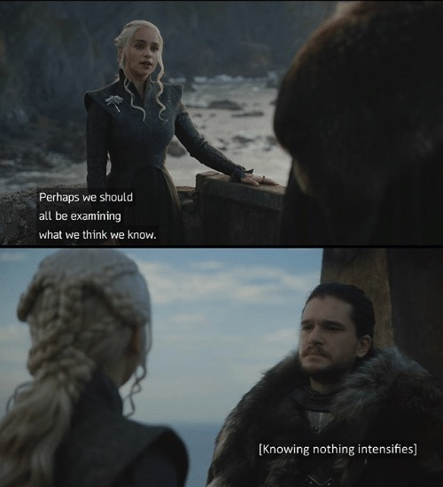

After I've shared [my thoughts](/musings-about-building-websites-out-of-wordpress-blocks/) on the shortcomings and challenges of building websites out of (WordPress) blocks, a couple of people heavily involved in the process of making such a website building system a reality expressed their interest in hearing more about my views on the specifics of establishing relations between blocks, on _growing_ inherently adaptive and resilient blocks systems. 

As I alluded by the end of that essay, for the past couple of years my team at [Pixelgrade](https://pixelgrade.com) and I have been bumping into this problem from all sorts of angles, and I am confident our hard-won lessons, partial and biased as they certainly are, could prove valuable on the long, winding road toward **a satisfactory solution.**

As I started drafting in my mind's notebook how to best portray our journey and findings, I found myself missing a valuable piece of this puzzle, one that precludes a thorough understanding of my points of view. I feel that without this, all would be either easily dismissible as nonsense, shortsighted, or heavily biased and narrow, or swiftly misinterpreted into false conclusions based on personal background and affinity. Neither scenario would sit well with me. Not without giving it a try first.

**The missing piece is a shared understanding of what a WordPress theme's role and responsibility are, as I see them.** Throughout the WordPress community, people either hold iron-clad opinions about what a theme should or should not do (focusing on the latter), or they gently toss this whole thing to the side since it doesn't matter in the end — a nuisance best left to people with too much time on their hands. Needless to say, I find both camps lacking. I am more of a question-what-you-are-doing-so-you-don't-end-up-in-the-wrong-place kind of guy.

## Semantics
There is "theme," then there is "WordPress theme", and then there is _this other thing people actually need and want._ More on that later.

I am throwing "theme" left and right here because that is what people are used to, not because there is some inherently useful meaning to this word. Actually, quite the contrary. For my understanding of role and responsibility attributed to this entity, the term "theme" is a nuisance. It's all fluffy and neutral, a subtle veneer on something of actual importance. My views couldn't be further from this.

One can't speak about themes without inviting the "royalty" of the land: _plugins._ I have to hand it to plugins: their name has a certain punch, commands a level of respect, has a physicality to it. Also, **plugins come in packs** since you can have multiple plugins active at the same time, as opposed to themes' lonely existence — at least they can have children.

I would be delighted if, at one point, we could do away with concepts like "theme" or "plugin", and instead call everything we bolt unto our bare WordPress installation just "module" or "add-on". Because **that is all there is to it: you get something out-of-the-box with the ability to receive and interact with lots of other _third-party modules._** Some of those modules will be more focused on frontend styling and layout, while others will more functionality-heavy focused on building, management, and analysis tools. We live in this world already, and I don't see much sense in keeping up with the illusion of themes and plugins.

The closest term I can come up with to capture my perspectives on what makes for a good WordPress theme is: "solution". Let it reverberate a little bit: _WordPress solutions.. Site solutions.._ It has a nice ring to it, somewhat punchy, but most importantly _sharp and opinionated._ Just what the doctor ordered!

## Late at the table
_This is so passé, Vlad! Aren't themes dead already?_

<video src="./bored-cat.mp4" autoplay="" loop="" muted="" playsinline="" onerror="this.onerror=()=>{};this.src='./bored-cat.mp4';"></video>[Source](https://giphy.com/gifs/cat-ball-board-3o85xGr7NxBC4eGTte)

With all the funeral "songs" of late, it does seem like a futile thing to talk about. My all too self-conscious radar is surely beeping about being defensive, stuck in a past best to be forgotten, protecting my livelihood, my company's moat even.

Allow me to go on record: **I have no problem if WordPress themes as we know them will go extinct.** In fact, if this is to happen, make it sooner rather than later. Let evolution run its course. I won't be jumping for joy, nor will I be saddened or frustrated. I will just step back and look at how and where those scattered pieces have fallen, focusing on what comes next.

But before that happens, _let's not bury our heads in blocks_ and, after a year or so, wonder what killed the dinosaurs. While these "dinosaurs" are still around, it's worth understanding their function in this ecosystem, so we can better cope with and manage a world without them.

## Bad theme! Bad!
Coders will be coders. They ingest and digest a problem through code. A little too much, if I may say so. The "classic" WordPress theme is now pummeled into oblivion under the banner of architectural code changes. Code that was part of a theme now gets shuffled around into the block editor, individual blocks, block patterns, block templates, block template parts, even the WordPress core (outside of the editor) is looking at a piece of the pie.

The Gutenberg induced power-rush seems to be making everything up for grabs. And there is no easier target for a self-respecting, DRY-following, sprint-focused coder than those pesky themes.

If you read between the make.wordpress.org posts, thousands of GitHub issue comments, and across the thousands upon thousands of Slack messages in all manner of channels, it becomes all too clear that there is something _very wrong_ with themes as they've ended up after 16 years of WordPress. 

*— They do too much. They bundle up styling, layout, and sometimes — for heaven's sake, functionality. They use tabbed admin options pages and sections upon sections in the Customizer. They obnoxiously require and recommend plugins for things to work. They style both the frontend of your site and the editor. They lock-in user-generated content. They provide fonts and icons, slideshows and galleries, shortcodes and widgets, demo data and full-screen onboarding, notifications and pop-ups, meta boxes and.. (hyperventilating by now) They.. They no good.*

*— Code, good code, smart code, 'code' code should not look like this. Code should not be organized like this. Code has come a long way, and we can code better. Code should aspire for single responsibility, for clarity of purpose.*

Always pay attention to someone with dragons - Game of Thrones TV series

My first response to all of this is: **you are absolutely right!** Themes do all that, and then some — I don't agree with everything they do, but they do it nonetheless. Yes, it is not the ideal environment for prestigious code. Yes, lots and lots of themes are of Frankensteinian decent (mainly multi-purpose themes). Yes, many themes haven't aged well.

My second response to all of this is: **you are absolutely blind!** You are blinded by your self-reinforcing appreciation — dare I say _love_ — of code. You see code where there are actually solutions to problems you are not even aware of. You see code where actual real user needs, quirks, shortcomings, and biases are being met or mitigated. You see code where there is history, legacy, and iterative evolution. You see stagnating code where there are actually happy, calm users than go on with their lives.

## Good boy!
[Source](https://www.pinterest.co.uk/pin/701154235718852406/)

It is all too easy to consider anything and everything bad — especially when we put our critical-thinking maker hat on. We even have [a bias](https://en.wikipedia.org/wiki/Negativity_bias) to nudge us in the "right" direction, one that I struggle with every day. 

Like any subject of one's judgment, WordPress themes are neither good or bad. What is bad or good is _how they make us feel,_ how they help or get in our way, how they bring us joy and ease of mind, or wasted hours or days. That is what is important to me, and to all the customers I've been talking to over the years. **Code is only important when it gets in the way,** when a PHP error pops up, when some JavaScript crashes your entire page or editor. Apart from these, code is like air: crucial, but invisible.

So, what is **the good WordPress theme?**

A good WordPress theme is like an onion: layers upon layers of tightly wrapped decisions and options, with a sweet, opinionated core, and some tears in your eye when you try to peel it apart.

**A good WordPress theme is a solution for a specific set of problems,** not too many, not too few. Such a theme will not "empower" the user with every CSS property imaginable, nor will it needlessly restrict the site owner's ability to make his site.. his. A good, solution-oriented theme will not back away when the going gets rough, but will push on with even more determination (and decisions). It will own its responsibility to take care of the shitty parts, so the site owner doesn't have to.

**A good WordPress theme is a clear contract between a solutions seeker and a solutions provider.** It is a partnership on the road to website Nirvana. Such a theme will not seek to give you false hopes or try to educate you into every part of the WordPress documentation. It will present you with the facts of the solution it is offering, its decisions and limitations, its ideal use case and the range of flexibility it is capable of.

**A good WordPress theme is a complete, integrated solution.** The team behind it has taken upon itself to research and analyze the needs of site owners from a specific niche; to find a common set of needs those may have and identify the best ways to leverage the huge WordPress ecosystem to best fulfil those needs. A good theme will not be afraid to pick certain plugins and build a solution with them in mind. It will also not hide or shy away from such biased decisions. On the contrary, it is ready to explain how each choice is a step toward overcoming the overall challenge.

**A good WordPress theme is safe to operate.** The theme makers have thought about as many scenarios as they can imagine (and have time for) and put safeguards in place to prevent you from "hurting" yourself (and your site). Where safeguards were not feasible, they have restricted or discouraged you from accessing that part. A good theme is a source of joy and accomplishment because it keeps all that could hurt you (including yourself) at bay.

## Nothing gets lost
As you can see, in my book, (good) themes have a lot of responsibility. It's not an easy burden to carry, nor without its trappings and dead-ends. But **it is a responsibility the end-user expects you, the creator, to take upon yourself.** Life has shown me, time and time again, that whenever something goes wrong with a site, the first thing that comes to everyone's mind is: _there must be something wrong with the theme!_ No matter if it is obviously something related to a premium plugin that you have purchased (and got support for), no matter if the issue happens after you've updated some random plugin. **The default is always the same: the theme is to blame.**

There was a time when I rebelled against this "injustice." I would do my best to "educate" the customer in "the WordPress way", in "the free and open-source software way." I would pull out my common-sense wand and try and tickle one's reasonable, rational side. To no avail.

Battered by this constant tug-of-war, exhausted, and dumb-struck, I reached a low enough point where I was forced to look in the mirror. I wish I had done it sooner. What I saw in that mirror was *a coder with a WordPress complex.* I realized that at some point I took "the WordPress way", made it my own, and turned it into gospel. I considered myself better than that, but there I was.

I somehow managed to misinterpret what users were saying. Under "the theme is to blame" is hidden a far nicer meaning: "the theme is responsible" as in "it's the theme's job to take care of that." I am hardly a customer-is-always-right kind of guy, but the customer _was_ right this time. **This is actually a gift (even if forced upon) the user is doing to any theme author.** The user is basically saying: you need to take this responsibility from me, and charge me for it. Consulting agencies have always known this; it just took us a while to come around.

Winding the drama knob down, what does all this have to do with WordPress themes burning and rising anew from their own ashes? — sorry, the knob seems to be broken. 

It has everything to do with the **dismantling of themes** in a block-based world. Code may be easily split and modularized or transferred to other entities, but the responsibility? Where do you begin? Is there anyone willing to take the nasty, tangled parts of this responsibility? 

As things stand today, **the responsibility that used to be in the themes' domain is not being picked up** by neither the new editor, blocks, block patterns, or what have you. Actually, the general consensus in Gutenberg is that **everyone should "Embrace and enhance users being in control."** 

Let me translate that into layman terms: **WordPress is taking a responsibility dump on the user.** Not good, not good at all.

## Consumer packaged goods
The concept of theme, as it evolved alongside WordPress itself, has another advantage that is often overlooked: **the theme is a way to package the solution for  users to consume.** You should not discount the benefits brought forth by packaging — not in between supermaket aisles, nor in digital shops.

If the new editor gets its way, this de-facto packaging standard for distributing whole site solutions to end-users will be gone. Sadly, the need for such a standard will not disappear. WordPress needs to come out with a new way, preferably a better way to bundle up a site solution and deliver it into the hands of eager clients. 

A swift push back against this may be done by exemplifying the themes on WordPress.org: _themes that are hardly "site solutions"; focused, narrowed themes only handling styling and layout; all themes should be like that._ I can only spare a few words toward such views. Looking only on WordPress.org themes is missing the point — in a grand way. **Premium WordPress themes is where the real action takes place,** where WordPress gets to be an adult and tackle real-life challenges.

## Lord, won't you buy a.. washing machine?
[Source](https://pin.it/y4cc2pga3urcmh)

I have only one more thing to stress about WordPress shooting itself in the foot — and killing themes in the process. 

Before the new block editor came to be, a bare-bones WordPress installation was very much *focused on the end-user.* Despite the overly complex dashboard, you could see that everything from the "5 minutes install" wizard to the copy used throughout the WordPress admin area, all was trying to help a non-technical user get going and build a site he or she could be proud of.

As one's needs moved across the spectrum between WordPress newbies and WordPress developers, the ecosystem pitched in and provided solutions at every point. Need a simple but beautifully designed site, there is a niche, cheap theme out there. Need a portfolio, restaurant, magazine site, pick and choose from a wide variety of sources. Need a full-blown ecommerce site, no problem — bolt-on WooCommerce and 5-10 add-ons and go warp speed. Need to control transients, Redis caches, background actions, transactional emails, database queries, pick one of the many plugins or write your own. **The ecosystem would unfold in accordance with your needs, always defaulting on the lowest common denominator.**

With the new editor, WordPress gets increasingly shaky in front of the whole spectrum of people. While the new content editing experience is much, much better than the previous one, it comes with greater complexity (thousands of blocks to chose from, each with fine-grained controls). Moving up, the design of entire pages is exposed to you, in great detail and control — very nice for designers and developers, but scary for people just looking to publish a post. More to the top, a global system of styling and layout will be (eventually) put at your disposal — again, nice for one part, cognitive-freeze for the other. **WordPress is becoming more capable, which is a blessing and a curse.**

Imagine WordPress (with Gutenberg) is a washing machine, and you would go to some late 19th century English Lord's mansion to sell it. You know he doesn't walk around in dirty clothes already, so what is the value proposition that will close the sale? You bet on a timeless human trait: greed. After persuading a couple of reluctant butlers to let you have a go, you sit in front of the Lord and deliver your living-room pitch:

*— How would you feel if I told you could reduce 25% of your staff and replace it with a new, state-of-the-art washing machine? Fully automated, you just need to put in the laundry, throw some detergent, close the door, and your off to the races. A couple of hours later, upon your return, all your clothes are nice and clean. Just string them out to dry, a little ironing and presto!*

_The Lord listens, politely, lets you finish, and:\
— Young man, your ambition is quite something. Alas, it is misplaced and wasteful of my time. But since my mood is already ruined by such lack of foresight, I will indulge you with my thinking: Your entire premise is utterly and completely without any basis in reality whatsoever. While I would not pass an opportunity to enhance my financial situation, **I do not wish to do so if that means I have to work more.** In fact, your proposal is far more sinister. You would have me replace my housemaids with this machine, and instead of me being the one served, you would have me become the servant, the servant of a bloody washing machine — feeding it, emptying it, cleaning it, fixing it. A clever little trick, but: I DO NOT LAUGH, MY BOY! I do not need a washing or any other cleaning machine. What I need is clean, ironed clothes, clean rooms, clean bathrooms, clean dogs, and a clean lawn._

Needless to say, you can kiss your commission goodbye. Now, the situation would be entirely different if you would try to sell your washing machine to a 50's suburban housewife. You would just mention "fully automated" and.. sold. You would even gain an order for a dryer, to boot. The fit between your prospective customer and your product is just much, much better.

One thing themes have done for WordPress is they have morphed the outer shell to fit both the Lord (actually his servants, to keep up with demand), and the housewife, and the local laundromat, and kickstarted the new trend of washer-dryers. **Themes, mainly premium ones, have been the integrators of the WordPress world,** the hands and feet of the entire WordPress ecosystem.

People at the helm of steering WordPress and Gutenberg need to remember this, or there will be no more hugging (for a lack of hands and feet). Oh Lord... 

`video: https://youtu.be/PLvK8QOOZwY`
