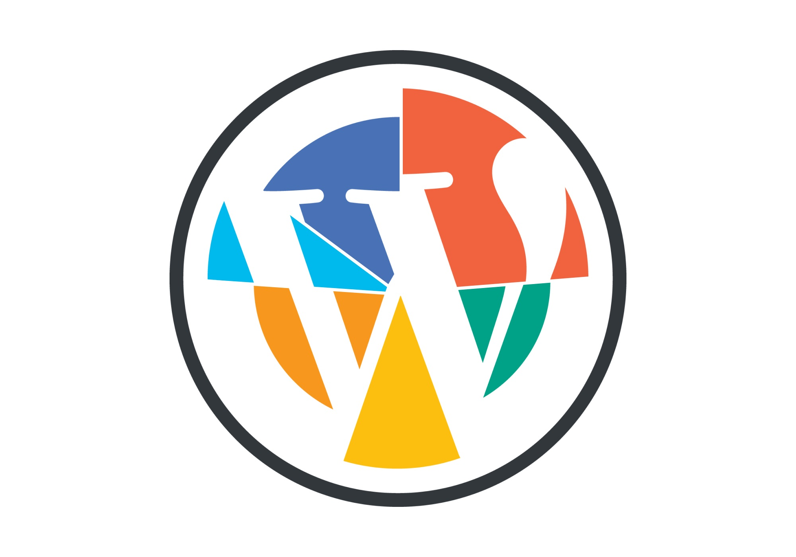

Today, the WordPress economy, a vital part of the ecosystem, is experiencing some severe growing pains. Long ignored imbalances, obsolete beliefs, and governance vacuums, to name a few, coupled with monopolistic and polarizing tendencies of the greater digital economy, threaten to completely change the nature of WordPress. 

Unless more of us start to consider a wider viewpoint, start discussing openly about what is happening in light of our shared values and principles, unless we find the strength to call out hypocrisies and conflicts of interest, we may very soon find ourselves looking at a WordPress ecosystem far removed from the ethos that galvanized the interest and dedication of so many.

This is me doing my part. I hope it helps.

Illustration by: [Mihaela Olaru](https://www.instagram.com/elaolaru/)

First of all, some _clues_ about my background so you can gauge _the biases_ that may push me in certain directions. I've been working with WordPress in one form or another for the past ten years. Going back about six years, WordPress has been my primary focus through my work at [Pixelgrade](https://pixelgrade.com/) (co-founder and CTO), a niche maker and seller of premium WordPress themes. 

My exposure to the WordPress economy has been quite wide starting with custom client work, continuing with products on [ThemeForest](https://themeforest.net) (an Envato marketplace), then expanding to [WordPress.com](https://wordpress.com), finishing with directly selling themes through a self-hosted shop at [pixelgrade.com](https://pixelgrade.com/) and distributing free WordPress themes through [WordPress.org](https://wordpress.org).

Now that you have a sense of my experience in the WordPress space, join me in _an exploration_ of the forces, trends, and future developments of this open-source ecosystem. The open-source basis is important because I believe **WordPress is a prime example** of the dynamics that naturally emerge in **any open-source software project.** Much of what follows ultimately ties back to this.

## What is the WordPress economy

For me, **an economy is all about value,** most importantly, _perceived value._ With this in mind, the WordPress economy is comprised of all those **individuals or companies that provide to or derive value from the WordPress project.** 

Customers that pay for a service or product are only one part of this economy. Just as important are core contributors (designers, developers, project managers, content writers, translators), community builders and advocates, legal advisers, WordCamps organizers and volunteers, meetups organizers, and the list could go on and on. 

On equal footing, we have the various individuals and companies that provide services around WordPress, create products to be used alongside it, and distribute those products to end-users. It matters very little if money exchanges hands. What matters is that value gets added and distributed in the ecosystem.

Places like WordPress.com, ThemeForest.net are clearly part of this economy, along with various agencies and themes or plugins shops. What people are not so clear about is _whether WordPress.org is part of it._ In keeping with the above, WordPress.org is definitely part of the WordPress economy as **the de facto free marketplace for everything WordPress.** As long as they are defining admission rules regarding code quality and security, managing the review and listing of approved items, and distributing them in the form of ready-to-use products, **this makes WordPress.org a clear marketplace, not simply a code repository** (that is what Github does).

## A little thing called GPL

The cornerstone of any open-source ecosystem is its software license — think of it as a social contract or bill of rights. WordPress adopted the [GNU General Public License](https://en.wikipedia.org/wiki/GNU_General_Public_License) (GPL for short). This license has some very clear and powerful characteristics:
- it's a _free **and** open-source software_ (FOSS) license meaning you don't just have to _publicly release you source code_ but you have to _allow its redistribution;_
- it's a [copyleft](https://en.wikipedia.org/wiki/Copyleft) type of license meaning that any piece of software that is based on GPL-licensed code _must_ also adopt the GPL license; many dub this as having _an infectious behavior._

**The GPL sets the stage** for all those involved in WordPress. No matter how hard any of them try to push it to one side, it stubbornly finds its way back in any meaningful argument or decision. It's not an elephant that stumbles over precious china, more like _a single-minded bull_ that will not allow anyone to forget they are in an arena under his reign. All this is _exactly_ how the GPL's creator envisioned it. No accidents or surprises here.

I've struggled a great deal in the past two years with the philosophy behind the GPL, it's economic and community implications, and, ultimately it's view of human nature. Today, I am _firmly_ in the camp of [Eric S. Raymond](https://www.linuxjournal.com/article/9911) and [David Heinemeier Hansson _aka_ DHH](https://m.signalvnoise.com/open-source-beyond-the-market/) concerning the alignment of GPL with today's software landscape: it makes little sense for **ideological and economic conditions of the 1980s** (as seen by a brilliant, but [awfull man](https://www.wired.com/story/richard-stallmans-exit-heralds-a-new-era-in-tech/)) to shape today's collaborations and solutions. We are now 30 years later, and in Internet time, that means a couple of centuries later.

_Note:_ If you are after a deep dive into the history, concepts, and biases behind the creation of the GPL by Richard M. Stallman and the Free Software Foundation, I highly recommend [Labyrinth of Software Freedom](http://www.softpanorama.org/Copyright/License_classification/index.shtml) by Nikolai Bezroukov. Try ignoring the lack-luster styling because the content is solid and quite enjoyable.

## Making a living in a GPL world

If one was to fanatically follow the license's intent, as some do, **no one could sell GPL software products.** Everyone should just generously give away all the code that they produce. _Replenish the commons_ as the 19th and 20th-century egalitarians warned.

Sadly, developers are also human and need some money to get by in this capitalist world. Richard Stallman had a now-infamous solution: _work at a fast-food by day and code by night._ It would make for a good joke if he didn't actually mean it and crafted a software license to match.

But developers are inventive, ambitious, high-maintenance creatures. A time-intensive, low-paying job would not cut it. Along came the equally infamous solution: produce free, quality software, win a reputation, and do consulting work for clients that use it — **sell services.**

Now, what about the folks that don't enjoy client-work endlessly and wish to take a stab at working full-time on digital products? Well, there is a solution for this too, "the GPL loophole": **don't distribute your GPL-licensed code, just sell access to it.** The SasS (software-as-a-service) business model was the obvious tactic. Few people seem to notice _the absurdity_ of the situation: it defeats the whole free and open-source thing, the contributing back to the commons mantra. But who cares?! There is no violation of the license — everything is just fine, at least in the minds of purists.

I don't know about you, but this all feels like having a nail and using it as a toothpick, a tool to scribble on walls, to stab others [in self-defense], anything but the obvious: _get a hammer and drive it through a piece of wood._ All because someone, at some point in time, had an exaggerated wood appreciation or a misplaced nail-on-wood fetish.

## Selling GPL-licensed software products

Human nature, being.. well.. human nature, could not simply accept the counter-intuitive reality consequence of the GPL. People want freedom in _the way they do business and value their work._

Along came **the split-licensed** WordPress themes and plugins that pushed the whole derivatives narrative to its limits by arguing that only the PHP code qualifies as a derivative work under the terms of GPL, while the rest of the product (CSS styling, JavaScript code) is free to use other licenses. For any actual user of a plugin or theme, both parts are needed to get some value from the product. Product makers used this to enforce a stricter license that would, in effect, eliminate the free part from the "free and open-source" nature of GPL. If this is in line with the GPL is an ongoing debate with no end in sight.

The vast majority of individuals and companies selling products in the WordPress space did "the right thing" (under pressure from Automattic and WordPress.org) and chose a "100% GPL" license, distributing _all their code_ under the GPL. If you have followed along, I guess the first thing that comes to mind is: _but how can they stay sustainable since, in an extreme situation, they could sell each product just once, after which that buyer would distribute it for free?_

The reality is that all those individuals and companies are _at the mercy of decency._ They simply _hope_ that extreme scenario will not happen. They all rely on customers doing, yet again, "the right thing" and actually buy the product they wish to use. Some do, some don't. As a precaution, product makers have reached back to the "sell services" solution: you only get product updates and, most importantly, product support (a service in disguise) if you actually buy the product — shaky, stressful way of doing business.

---

After this whole extended introduction, _a simple question_ begs for some answering: _who does the GPL benefit since everyone seems to be fucked in one way or another?_ Let's explore some possible answers.

## What customers haven't asked for

Someone buying a GPL product is _automatically_ empowered by **the four freedoms,** whether she knows it or not:
- run the program as you wish, for any purpose _(freedom 0);_
- study how the program works, and change it so it does your computing as you wish _(freedom 1);_
- redistribute copies so you can help others _(freedom 2);_
- distribute copies of your modified versions to others _(freedom 3)._ By doing this you can give the whole community a chance to benefit from your changes. \
[_GNU - What is free software?_](https://www.gnu.org/philosophy/free-sw.html)

Great! More freedom to the people! If only they've asked for it or knew what to do with it.

In the everyday reality of people that seek a solution to a problem of theirs, **only the first freedom counts.** The rest matter only to fellow developers. This is a classic example of coders' self-absorbed importance and over-optimization. They tend to suffer from this quite a lot, by [my judgment](https://thinkwritecode.com/fixing-the-word-one-code-release-at-a-time/). 

After years of interacting with customers of all kinds and helping them get the most out of their purchase, I can safely say _the GPL is last on their list of concerns,_ if at all. It seems that the GPL, as opposed to other, friendlier, OSS licenses like [MIT](https://en.wikipedia.org/wiki/MIT_License), is not making _a meaningful contribution_ to the lives of non-technical software users.

## Corporatize the anti-corporate

The GPL was openly aimed at messing with (preferably destroying) the big, closed-source corporations of the 80s and 90s (think Microsoft, Oracle, IBM, etc.) in an attempt to save society from their evil clutches. It's the purest distillation of saying "Fuck you!" to a big tech corporation. A worthwhile stance, at least until the corporation, ever resourceful and farsighted, answers back with "Okay!"

Corporations realized that open-source software is actually a very big opportunity for them, with benefits in all the right places. Their instinctual fear of customers taking their software and walking away was far removed from reality. Customers actually didn't care, didn't have the technical skills to do the walking away, or knew how to bypass licensing logic and wouldn't give a damn about EULAs.

Open-source was ticking corporate boxes with surprising ease:
- democratic at first glance but with totalitarian tendencies when making decisions (who doesn't like a Benevolent Dictator For Life, BDLF for short?);
- labor intensive requiring massive investments, but with plenty of free contributions;
- a badge of honor for developers on payroll with little extra motivation required;
- trustworthy security with mostly free peer-reviews;
- great public relations with free marketing and employer branding.

WordPress, as an open-source project, followed the same route, even picking up speed in recent years. It reached a point where the market economy is clearly leaning toward big corporations: hosting providers, Automattic (wordpress.com), and fellow large agencies serving enterprises, taking the spoils on one end, and freelancers or small teams doing consulting work, at the other end, fighting over scraps. There are few successful entities in the middle. 

The obvious middle players, themes and plugins shops, get acquired left and right — it's open season for Mergers & Acquisitions (M&A, in corporate talk). Even here, the GPL lends a helping hand to bigger players looking make a purchase at the expense of makers: **product companies have little bargaining power during negotiations** since they can't actually value their products (prospective buyers could just fork them), only their brand, existing customer community, and their employees. 

It sure seems like a far cry from "democratize publishing." More like "corporatize publishing."

## Brand over code

As plainly stated by the GPL — if you look at it with your business glasses, code is _only_ destined to be poured into that big bucket called "the commons", creators losing all rights and most financial value. As long as the project "honors" developers with their contributor badge, all is forgiven. I find it hilarious that a software license meant to protect passionate, idealistic developers (and the world) from the onslaught of evil corporations, ends up stripping those same contributors' work of any _meaningful value._

But value is like energy: it never gets lost, it only changes hands. If someone's work is discreetly stripped of ownership and value, someone else must be the recipient of that same value. Besides the community that gets to "graze" on a replenished "commons," **a fair amount of value goes to the brand of that particular project.**

In today's digital landscape, the GPL license is proving to be just right for those who are after the brand of an open-source project, not its code. In the WordPress ecosystem, **the GPL is favorable only for platforms** like WordPress.com **and agencies** banking on the trust _WordPress the brand_ commands. Product creators benefit to some extent from the extended market size, but they have a much harder time _distinguishing their work_ from the _free WordPress core_ and _free WordPress.org marketplace_ sub-brands.

_WordPress the brand_ has become much more powerful and valuable than _WordPress the code._ The WordPress community of developers, designers, marketers and users is **a massive marketing machine** for whoever is better positioned to capture brand value.

By now, it should come as no surprise that **Automattic has sole rights** to use _the WordPress trademark_ for [commercial purposes](http://wpandlegalstuff.com/using-wordpress-trademarks-business-product-service/) (it actually [was _their_ trademark](https://wordpressfoundation.org/2010/trademark/) to being with). The other important entity with full rights to use the trademark is WordPress.org controlled by the CEO of Automattic through the WordPress Foundation. I don't know about you, but **to me, this game seems awfully rigged** when it comes to free-market competition.

If we turn our focus to _WordPress the code,_ the balance of power is the same, despite the thin veil of community control. The WordPress core is very much stale when it comes to meaningful changes to improve extensibility and contributions, hence give everyone a fairer chance to succeed. Just look into these areas or initiatives: the WordPress dashboard, WordPress Fields API, WordPress block editor, to name a few. For those of you in the know, the WP-REST API doesn’t qualify since it is focused less on extensibility, but on data portability.

Looking at the way stuff got done in recent years, a lack of interest from Automattic or enterprise-focused agencies equaled a deafening silence among core committers and, consequently, lack of effort and focus. If any of them showed keen interest, this translated, almost overnight, into a massive push to get things done. **The perfect example of this state of affairs** is the surprising speed and efficiency with which the new block editor (Gutenberg) came into being [in the WordPress core].

I think it is fair to say that _the fortunes of WordPress are firmly in enterprise hands._

## Winter is coming for WordPress plugins 

Premium plugins, in stark contrast to premium WordPress themes, had a good ride this past couple of years. They've managed to keep and even increase their projected value while experimenting with more sustainable business models: monthly or mostly yearly subscriptions. Plugins managed to increase their prices across the board, without much pushback from customers.

I am afraid the good days are coming to an end for premium WordPress plugins. First, promising, platform-like plugins get scooped up and merged into the offerings of hosting services and platforms like WordPress.com. Second, many successful, functional plugins are either bought or replaced by similar solutions on platforms (hosting services are the main actors here). Third, successful page-builder plugins will only get bigger, bundling more and more functionality. 

That leaves only highly targeted plugins with a fighting chance of staying independent — and these are overwhelmingly technical, primarily aimed at site administrators.

## Dismantling WordPress themes 

Premium WordPress themes had their glory days until about three or four years back. I know this since my team and I experienced it first hand. Sadly, neither the broader community nor I saw what was just around the corner. 

First, the market started a race-to-the-bottom pricing war, only benefitting platforms like Envato. Some of us stayed put and refused to engage. It made little difference since **the customer's mind was hooked on ever-decreasing prices.** Second, **page-builders started to chip away the value-proposition of themes,** cleverly incentivizing them into ever-tighter integrations. Third, **the new default WordPress block editor** is in the process of delivering the final blow to themes as we know them.

Themes seem to be targeted from all sides. There is a good reason for this onslaught: _design as a product is not aligned with the interests of large players in WordPress, and the web in general._ It is getting increasingly harder to sell design, and nobody, besides themes, has any incentive to do that. The trend is to sell entire sites or solutions to specific problems. **Design has become a selling vector for platforms and agencies, not a product in and of itself,** despite the constant struggles of serious theme shops.

The premium WordPress themes market is getting thinned out: on the low end, you have massive upsides for platforms (like WordPress.com, GoDaddy, Elementor) that don't really need themes as products, just decoupled, standardized, preferably free designs; on the high end, you have all the tools to build complex systems (Gutenberg, WP-REST API, platform-like plugins like WooCommerce), systems that can easily bear the costs of custom design work.

Once Gutenberg delivers full-site editing capabilities, and the block directory is in full swing, you can be sure themes will be reduced to merely providing a general, style-guide CSS. Few people will be willing to pay for that.

Unless **themes makers manage to take the initiative and do their own dismantling** before the ecosystem does it for them, times ahead are pretty grim. Without a doubt, this process will take some serious _creativity, effort, and preferably collaboration_ between like-minded theme shops. I see **no other way to at least survive and possibly thrive** in this new WordPress landscape.

## Alternative futures

I am not a fatalistic person, focused only on what is wrong with the world. I consider myself quite optimistic and fully aware that **the most likely future seems inevitable as long as nothing changes.** Things can change, and they should.

Individual contributors, small and medium-sized companies, and well-intended customers are, in fact, _the overwhelming majority_ of this ecosystem. We should push for a much fairer representation structure by supporting initiatives like [the WordPress Governance Project](https://wpgovernance.com/). **Without regaining some control over decisions processes, this economy is at the mercy of few.**

Each of us needs to **start paying more attention to our brands** through the way we communicate with our peers and our customers, through how consistent we are in our decisions on sensible topics, all the way to speaking up whenever we get the chance, with clarity and purpose. The WordPress ecosystem needs more diversity in strong brands that contribute to and influence its future.

Each of us needs to **embrace our ability to walk away from WordPress.** It is liberating to know you can carve a destiny elsewhere if that is what you chose. It also gives added strength and importance to each of us, as we would no longer be sheep to be herded around.

When it comes to alternate futures for WordPress plugins, I have little to offer today, besides the above.

When considering other ways WordPress themes could contribute in the future, I have a few ideas. Themes authors [should engage](https://github.com/wordpress/gutenberg/issues) as much as they can with the current developments of the WordPress block editor, not so much through code, but _clear arguments._ 

At the same time, we could _finally_ embrace what we've known for so long: **customers want a complete site solution from us, not just a layer of styling.** Don't let the WordPress.org purists tell you otherwise. In accepting this, we may discover _great bargaining power_ both in terms of pricing and in the overall economy.

If we **make the mental leap from theme authors to site solutions providers,** I believe lots and lots of opportunities will open up — they were always there, but "theme authors" can't _dream_ about them, it's not in their nature. **Site solutions providers,** on the other hand, could consider advanced, cloud-based wizards to set up a niche site, easier to understand abstractions like Colors or Fonts Palettes, adaptive, two-way design systems for agencies workers and customers, modularized offering with easy to understand pricing. I could go on and on. 

The crux of the matter is, despite all forces beyond our control, **the only real obstacle is our ability to think clearly and freely.** We are part of an open-source software project after all; clarity and freedom _should be central_ to the game.

---

Thank you for sticking with me this long. I've given it my best to make this exploration of the WordPress economy useful to everyone involved, without placing much blame on one actor or another. My goal is to understand the WordPress world for what it is while exploring what could be different. 

We need as much clarity in our minds and strength in our voices as possible if we are to help progress WordPress, and the web at large, in a meaningful way.
